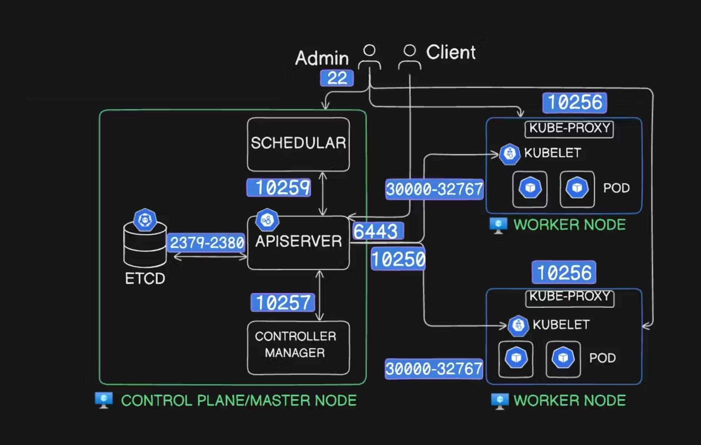
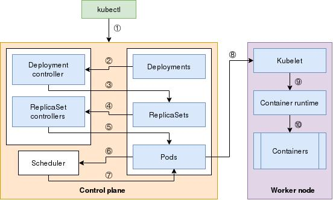

# Kubernetes en bref

Il est utile d’avoir une vue rapide de Kubernetes et de son fonctionnement si vous débutez.  
Ce chapitre résume les concepts les plus importants.

---

# Qu’est-ce que Kubernetes ?

Pour comprendre Kubernetes, commençons par définir microservices et containers.

Une architecture microservices consiste à développer une application sous forme de plusieurs services indépendants qui communiquent entre eux.

Si ces services sont exécutés dans des containers, il faut en gérer beaucoup tout en prenant en compte :

- la scalabilité  
- la sécurité  
- la persistance des données  
- le load balancing  

Des outils comme BuildKit ou Podman permettent de créer des images de containers.  
Des moteurs comme Docker ou containerd permettent d’exécuter ces containers.

Cela fonctionne bien sur une machine locale, mais devient difficile à gérer à grande échelle.

Kubernetes est un outil d’orchestration de containers qui permet de gérer des centaines ou milliers de containers sur :

- machines physiques  
- machines virtuelles  
- cloud  

Kubernetes gère aussi automatiquement :

- le scaling  
- la sécurité  
- la persistance  
- le load balancing  

---

# Fonctionnalités

## Modèle déclaratif

Avec Kubernetes, on ne dit pas comment faire.  
On décrit simplement l’état souhaité.

Exemple :  
on veut 3 pods  
Kubernetes maintient toujours 3 pods  

Cela se fait avec des fichiers YAML ou JSON.

---

## Autoscaling

Kubernetes peut :

- augmenter les ressources si la charge augmente  
- diminuer si la charge baisse  

Cela peut être manuel ou automatique.

---

## Gestion des applications

Kubernetes permet :

- déploiement de nouvelles versions  
- rolling update  
- rollback vers ancienne version  

---

## Stockage persistant

Les containers perdent leurs données après redémarrage lorsque les données sont stockées uniquement dans le filesystem du container.

Pour conserver les données, il est possible de monter un **stockage persistant**.  
Ce stockage est séparé du cycle de vie du container ou du Pod.

Kubernetes permet plusieurs possibilités de stockage persistant.

Ces mécanismes permettent de conserver les données même si :

- le container redémarre  
- le Pod est recréé  
- l’application est redéployée  

---

## Networking

Kubernetes permet :

- communication entre containers  
- accès externe  
- load balancing interne et externe

# Architecture kubernetes
Kubernetes est une plateforme qui permet d’exécuter des applications sous forme de Pods sur plusieurs machines appelées Nodes.
Le cluster est composé de deux parties principales :
- Control Plane → décide et gère
- Worker Nodes → exécutent les applications
<p align="center">
  
</p>
Chaque composant communique via des **ports** spécifiques.

### Control Plane
#### kube-apiserver
Point d’entrée du cluster.
Tout passe par lui : kubectl, kubelet, scheduler et controller manager
Port : 6443/TCP
Exemple :
```bash
kubectl → API server:6443
```
#### etcd
Base de données du cluster.
Stocke : pods, nodes, services, configs
Ports :
2379/TCP  client
2380/TCP  peer (HA)
Communication :
```bash
API server → etcd : 2379
etcd → etcd : 2380
```

#### kube-scheduler

Décide où lancer les Pods.
Port : 10259/TCP
Communication interne control plane.

#### kube-controller-manager

Maintient l’état du cluster.

Exemple :
```bash
replicas = 3
Il recrée pods si besoin.
```
Port: 10257/TCP
### Worker Nodes
#### kubelet

Agent sur chaque node.

Il :
reçoit instructions (depuis scheduler par exemple passant par apiserver)
crée pods
surveille containers
Port :10250/TCP
Communication :
```bash
API server → kubelet:10250
```

#### kube-proxy

Gère le réseau Kubernetes. (on va parler de ça dans la partie services)
Il :
crée iptables
load balancing
service routing
Pas de port externe fixe. 
Il utilise :
```bash
iptables / IPVS
```

#### Container Runtime

Lance containers:
containerd
CRI-O

Communication locale :
```bash
kubelet → runtime (socket unix) 
pas de port.
```
### Scénario : création d’un Deployment
<p align="center">
  
</p>

Tu exécutes :
```bash
kubectl create deployment nginx --image=nginx --replicas=3
```
Tu demandes à Kubernetes :
créer un Deployment
avec 3 Pods
utilisant l’image nginx
#### Étape 1 — kubectl contacte l’API Server
```bash
kubectl → API Server
```

L’API server reçoit :
Deployment nginx replicas=3
#### Étape 2 — API Server sauvegarde dans etcd
L’API server enregistre l’état désiré dans etcd
etcd :
Deployment nginx
replicas = 3
Kubernetes sait maintenant qu’il doit maintenir 3 Pods.
#### Étape 3 — Controller Manager crée ReplicaSet
Le Deployment controller crée :
```bash
Deployment → ReplicaSet → Pods
```
Donc :
```bash
nginx-deployment → nginx-rs
```
ReplicaSet veut :
3 pods
#### Étape 4 — Scheduler choisit les nodes
Le scheduler prend chaque Pod :pod1, pod2 et pod3
Il décide :
```bash
pod1 → node1
pod2 → node2
pod3 → node2
```
Selon : CPU, RAM...

#### Étape 5 — API Server informe kubelet

Chaque kubelet reçoit instruction :
create pod nginx

Exemple :
```bash
API server → kubelet node1
API server → kubelet node2
```

#### Étape 6 — kubelet lance containers

kubelet appelle container runtime :
```bash
kubelet → container runtime
container runtime → container nginx
```
*Si un Pod tombe*

Exemple :
```bash
pod nginx node2 crash
```
ReplicaSet détecte :
3 voulus
*2 existants*
Il recrée :
new pod nginx
Scheduler choisit node.
kueblet reçoit instruction etc