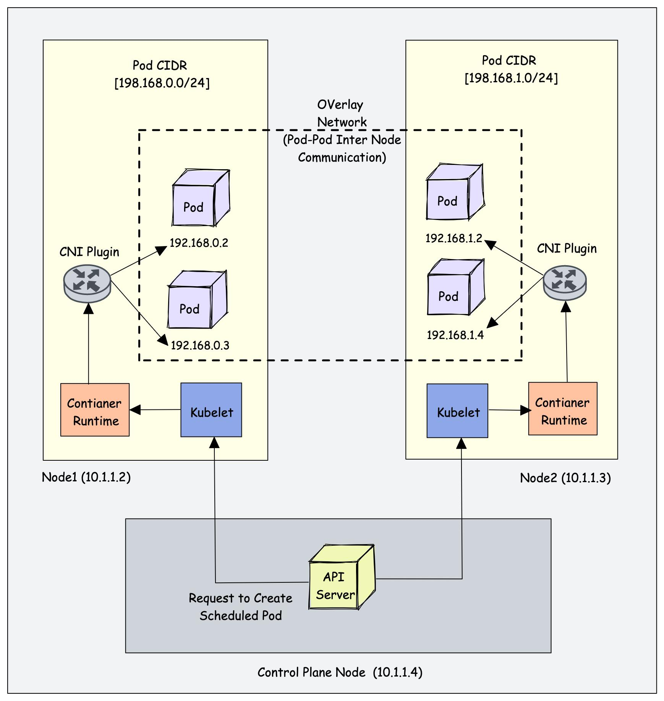

# Kubernetes Cluster Networking

Dans un cluster Kubernetes, il existe deux réseaux principaux.  
Le premier est le **réseau physique des nœuds**, utilisé pour la communication entre les machines du cluster.  
Chaque nœud possède une adresse IP sur ce réseau.

Le second est le **réseau des Pods**, créé par Kubernetes via un plugin CNI.  
Chaque nœud reçoit un sous-réseau (Pod CIDR), et chaque Pod obtient une adresse IP unique dans ce sous-réseau.

Le plugin CNI assure la communication entre ces sous-réseaux et permet aux Pods de communiquer entre eux, même s’ils sont sur des nœuds différents.
## 1. Niveau le plus bas — Containers dans un Pod

Dans un Pod :

les conteneurs partagent :
- même IP
- même réseau (celle du pod)
- même interface réseau

Communication :
```bash
container A → localhost → container B
```

Donc :
```bash
Pod = 1 IP
Containers = localhost
```

## 2. Pod Network (réseau des Pods)

Chaque Pod reçoit une IP unique

Exemple :
```bash
Pod A → 10.244.1.2
Pod B → 10.244.2.5
Pod C → 10.244.3.8
```

Tous les Pods peuvent communiquer directement :
```bash
Pod A → Pod B
```

C’est le Pod CIDR

Exemple :
```bash
10.244.0.0/16
```

le Pod CIDR est créé par les CNI plugins :
```bash
Flannel
Calico
Cilium
Weave
...
```

## 3. Communication Pod et Pod (Nodes différents)

Comme mentionné dans Kubernetes :
- chaque Pod possède une IP unique
- chaque Node possède un sous-réseau Pods (Pod CIDR)
- tous les Pods doivent pouvoir communiquer sans NAT ( l'adresse de pod ne doit pas etre changé lors de communication)

Mais les Pods peuvent être sur des Nodes différents, donc :

- ils ne sont pas dans le même subnet
- ils doivent passer par le réseau des nodes

Kubernetes résout cela avec :
```bash
CNI plugin
Overlay Network
Routing inter-node
```

Le principe :
```bash
Pod → CNI → Node network → Node destination → CNI → Pod
```

Le CNI fait :
```bash
routing entre subnets Pods
encapsulation overlay
décapsulation côté destination
```bash

**Exemple de communication**

<p align="center">
  
</p>

Pod A veut parler à Pod B

Pod A = 192.168.0.2 (Node1)
Pod B = 192.168.1.2 (Node2)
Step 1 — Pod A envoie le paquet
SRC = 192.168.0.2
DST = 192.168.1.2

Pod A voit que destination n’est pas dans :

192.168.0.0/24

Donc il envoie vers gateway CNI.

Step 2 — CNI Node1 encapsule

Le CNI transforme :

192.168.0.2 → 192.168.1.2

en :

SRC = 10.1.1.2 → DST = 10.1.1.3
payload = 192.168.0.2 → 192.168.1.2

Donc le trafic passe par réseau nodes.

Step 3 — transport entre nodes
Node1 10.1.1.2 → Node2 10.1.1.3

via réseau physique.

Step 4 — CNI Node2 décapsule

Le CNI Node2 reçoit :

payload = 192.168.0.2 → 192.168.1.2

Il l’envoie au Pod B.

l'Overlay Network (Pod-Pod Inter Node Communication) est le tunnel créé par CNI. 