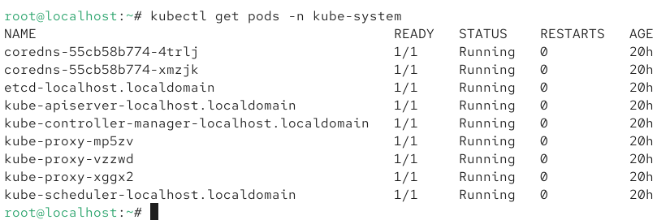
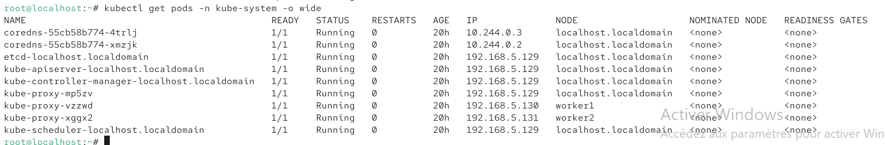

# installer Kubernetes Cluster kubeadm + Flannel (RHEL 10)

Cluster :

* 1 Master (control-plane)
* 2 Workers
* CNI : Flannel
* Méthode : kubeadm

---

## 0. Prérequis

Configuration minimale recommandée :

Master :

* 2 CPU
* **3 GB RAM recommandé**
* 20 GB disk

Workers :

* 1 CPU
* 1.5 GB RAM minimum
* 15 GB disk

Toutes les machines doivent communiquer entre elles via IP.

---

## 1. Définir hostname unique

Chaque node Kubernetes doit avoir un nom unique pour éviter les conflits lors du join.

### Master

```bash
hostnamectl set-hostname master
```

Cette commande change le hostname de la machine pour que Kubernetes identifie ce node comme control-plane.

### Worker1

```bash
hostnamectl set-hostname worker1
```

Cette commande définit un nom unique pour le premier worker.

### Worker2

```bash
hostnamectl set-hostname worker2
```

Cette commande définit un nom unique pour le second worker.

---

## 2. Configurer /etc/hosts

```bash
vi /etc/hosts
```

On modifie le fichier hosts pour que chaque node puisse résoudre les noms master, worker1 et worker2.

Ajouter :

```
192.168.5.129 master
192.168.5.130 worker1
192.168.5.131 worker2
```

Tester :

```bash
ping master
```

Permet de vérifier que la résolution DNS locale fonctionne.

```bash
ping worker1
```

Teste la communication réseau vers worker1.

```bash
ping worker2
```

Teste la communication réseau vers worker2.

---

## 3. Désactiver swap

```bash
swapoff -a
```

Kubernetes nécessite que la swap soit désactivée sinon kubelet refuse de démarrer.

```bash
sed -i '/ swap / s/^/#/' /etc/fstab
```

Cette commande empêche la swap de se réactiver après reboot.

---

## 4. Charger modules kernel

```bash
cat <<EOF | tee /etc/modules-load.d/k8s.conf
overlay
br_netfilter
EOF
```

Cette commande configure les modules réseau nécessaires pour Kubernetes.

```bash
modprobe overlay
```

Charge le module overlay utilisé par containerd.

```bash
modprobe br_netfilter
```

Permet au kernel de filtrer le trafic réseau des containers.

---

## 5. Configurer sysctl

```bash
cat <<EOF | tee /etc/sysctl.d/k8s.conf
net.bridge.bridge-nf-call-iptables=1
net.bridge.bridge-nf-call-ip6tables=1
net.ipv4.ip_forward=1
EOF
```

Active le routage réseau entre pods Kubernetes.

```bash
sysctl --system
```

Applique immédiatement la configuration réseau.

---

## 6. Désactiver firewalld

```bash
systemctl disable --now firewalld
```

On désactive firewalld pour éviter le blocage du réseau entre les pods.

Alternative ouvrir ports :

```bash
firewall-cmd --permanent --add-port=6443/tcp
```

Ouvre le port API Kubernetes.

```bash
firewall-cmd --permanent --add-port=10250/tcp
```

Ouvre le port kubelet.

```bash
firewall-cmd --permanent --add-port=8472/udp
```

Ouvre le port overlay réseau Flannel.

```bash
firewall-cmd --reload
```

Recharge la configuration firewall.

---

## 7. Installer containerd

```bash
dnf install -y containerd
```

Installe container runtime utilisé par Kubernetes.

```bash
mkdir -p /etc/containerd
```

Crée dossier configuration containerd.

```bash
containerd config default | tee /etc/containerd/config.toml
```

Génère configuration par défaut.

```bash
vi /etc/containerd/config.toml
```

Permet de modifier la configuration containerd.

Changer :

``` bash
SystemdCgroup = true
```

Active cgroup systemd pour compatibilité kubelet.

```bash
systemctl enable --now containerd
```

Démarre containerd et active au boot.

---

## 8. Installer Kubernetes

```bash
cat <<EOF | tee /etc/yum.repos.d/kubernetes.repo
```

Ajoute repository Kubernetes officiel.

```bash
dnf install -y kubelet kubeadm kubectl
```

Installe les composants Kubernetes.

```bash
systemctl enable --now kubelet
```

Démarre kubelet qui gère les pods.

---

## 9. Initialiser le master

```bash
kubeadm init --pod-network-cidr=10.244.0.0/16
```

Initialise le cluster Kubernetes avec CIDR réseau utilisé par Flannel.

```bash
mkdir -p $HOME/.kube
```

Crée dossier config kubectl.

```bash
cp -i /etc/kubernetes/admin.conf $HOME/.kube/config
```

Copie config cluster pour kubectl.

```bash
chown $(id -u):$(id -g) $HOME/.kube/config
```

Donne permissions utilisateur.

```bash
kubectl get nodes
```

Vérifie que le master est enregistré dans le cluster.

---

## 10. Installer Flannel

```bash
kubectl apply -f https://raw.githubusercontent.com/flannel-io/flannel/master/Documentation/kube-flannel.yml
```

Déploie le plugin réseau Flannel pour permettre communication pods.

```bash
kubectl get pods -n kube-flannel
```

Vérifie que les pods Flannel sont running.

```bash
kubectl get nodes
```

Les nodes deviennent Ready après installation réseau.

---

## 11. Joindre workers
cette commande est fournit par l'output de kubeadm init. (copier puis coller dans les workers)
```bash
kubeadm join 192.168.5.129:6443 ...
```

Ajoute worker au cluster Kubernetes.

---

## 12. Reset si join faux

```bash
kubeadm reset -f
```

Supprime la configuration Kubernetes du worker.

```bash
rm -rf /etc/cni/net.d
```

Supprime configuration réseau précédente.

```bash
rm -rf /var/lib/cni
```

Nettoie plugins réseau.

```bash
systemctl restart kubelet
```

Redémarre kubelet après reset.

---

## 13. Recréer join command

```bash
kubeadm token create --print-join-command
```

Génère nouvelle commande join si token expiré.

---

## Vérification finale

```bash
kubectl get nodes
```

Résultat attendu :

```
master    Ready
worker1   Ready
worker2   Ready
```

## Pods Flannel

Voir pods flannel :

```bash
kubectl get pods -n kube-flannel -o wide
```

Flannel est déployé en **DaemonSet** (1 pod par node)

```bash
kubectl get ds -A
```

# C'est quoi le kube-system, le kubeconfig, fichiers de configuration importants du cluster?

## 1. Namespace kube-system
Le namespace **kube-system** contient tous les composants internes Kubernetes.
<p align="center">
  
</p>

```bash
kubectl get pods -n kube-system
```
On y trouve :
* **kube-apiserver** → point d’entrée API Kubernetes
* **etcd** → base de données du cluster
* **controller-manager** → gère les controllers
* **scheduler** → place les pods sur nodes
* **coredns** → DNS interne Kubernetes
* **kube-proxy** → networking services

Voir avec IP :

```bash
kubectl get pods -n kube-system -o wide
```
<p align="center">
  
</p>

---

## 2. Voir tous les namespaces

```bash
kubectl get ns
```

Résultat :

* default
* kube-system
* kube-public (contient ConfigMaps publiques du cluster qui contient des informations du cluster (comme cluster-info) utilisées notamment lors du kubeadm join.)
* kube-node-lease (namespace utilisé par Kubernetes pour stocker les objets Lease servant au heartbeat des nœuds.)

---

## 3. Fichiers importants du cluster

### le kubeconfig Kubernetes
Le kubeconfig est le fichier utilisé par kubectl pour savoir quel cluster utiliser, quel utilisateur approuvé et quel namespace a le droit de toucher : ces trois sont appelé un *context* .  

Dans Kubernetes, un cluster peut avoir plusieurs admins c'est à dire plusieurs contexts, mais kubectl n’utilise qu’un seul context actif à la fois.  

#### Voir le context actuel
```bash
kubectl config current-context
```

#### Changer de context
```bash
kubectl config use-context kubernetes-admin@kubernetes
```
Après kubectl config use-context, kubectl met à jour le current-context dans ~/.kube/config et utilise automatiquement ce cluster et cet utilisateur.  

export KUBECONFIG=... force kubectl à utiliser un autre fichier kubeconfig à la place de ~/.kube/config.

```bash
echo $KUBECONFIG
```
Fichiers importants :

```bash
ls /etc/kubernetes/
```
* admin.conf → accès kubectl cluster
* kubelet.conf → config kubelet
* controller-manager.conf
* scheduler.conf  

Ces fichiers sont des kubeconfig utilisés par les composants Kubernetes pour se connecter à l’API server, chacun contenant un context (cluster + user + namespace) qui définit comment *s’authentifier* et *communiquer* avec le cluster ; ils sont générés automatiquement par kubeadm init et utilisés respectivement par kubectl (admin.conf), kubelet (kubelet.conf), controller-manager (controller-manager.conf) et scheduler (scheduler.conf) pour accéder au cluster.


## Comment démarre le cluster?
le premier composant qui démarre est kubelet (celui dans le master node), et c’est lui qui lance le control-plane via les static pods. 

 ```bash
kubelet démarre
→ lit /etc/kubernetes/manifests
→ crée etcd (static pod)
→ crée kube-apiserver
→ crée controller-manager
→ crée scheduler
→ API server devient disponible
→ le cluster commence à fonctionner
```
Les static pods a créé par le kubelet sont 
```bash
ls /etc/kubernetes/manifests/
```

* kube-apiserver.yaml
* kube-controller-manager.yaml
* kube-scheduler.yaml
* etcd.yaml

Configuration kubelet

```bash
cat /var/lib/kubelet/config.yaml
```
pour lister les static pods créé par le kubelet on fait
```bash
crictrl ps
```
---
#QUESTION  
The kubernetes cluster is not working. Some components are dowb after a cluster migration.
Troubleshoot the cluster and fix the cluster
---
#CORRECTION  

Après une migration, le cluster peut tomber car **kube-apiserver pointe vers l’ancienne adresse etcd**.  
C’est une **erreur commune**, car l’API server dépend toujours de **etcd pour démarrer**.  

1. Vérifier les composants  
```bash
crictl ps
```
On voit généralement *kube-apiserver en crash* et etcd *Running*.  
2. Modifier static pod kube-apiserver  

```bash
cd /etc/kubernetes/manifests
```
```bash
vim kube-apiserver.yaml
```
3. Remplacer l’ancienne adresse etcd :

```bash
--etcd-servers=https://OLD-IP:2379
```
par :

```bash
--etcd-servers=https://127.0.0.1:2379
```
4. Redémarrer kubelet
```bash
systemctl restart kubelet
```

kubelet relit le manifest, redémarre kube-apiserver,
et l’API server peut de nouveau se connecter à etcd.