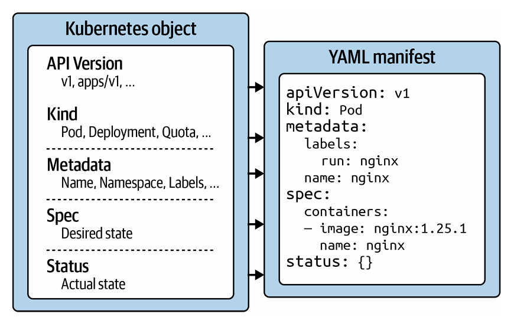
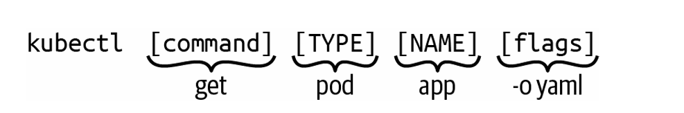

# Structure d’un objet Kubernetes (YAML)

<p align="center">
  
</p>

Tous les objets Kubernetes ont cette structure :
```yaml
apiVersion:
kind:
metadata:
spec:
status:
```
---
### apiVersion
Définit la version de l’API Kubernetes utilisée pour l’objet.
Exemple :
```yaml
apiVersion: v1
```
Lister les versions disponibles :
```bash
kubectl api-versions
```
---
### kind
Définit le type d’objet Kubernetes.
Exemples :
```yaml
kind: Pod
kind: Deployment
kind: Service
```
---
### metadata
Contient les informations générales :
* nom
* namespace
* labels
* annotations
* UID
Exemple :
```yaml
metadata:
  name: nginx
  namespace: default
```
---
### spec (desired state)
Décrit l’état souhaité de l’objet.
Exemple :
* image container
* nombre de replicas
* ports
* variables env
Exemple :
```yaml
spec:
  containers:
  - name: nginx
    image: nginx
```
---
### status (actual state)
Représente l’état réel actuel de l’objet dans le cluster.
Kubernetes compare :
```bash
spec (desired state)
        vs
status (actual state)
```
Les controllers Kubernetes essaient toujours de faire correspondre :
```bash
status → spec
```
Exemple :
spec :
```bash
replicas = 3
```
status :
```bash
replicas = 1
```
Kubernetes va créer 2 pods pour atteindre 3.
---
# Using kubectl

`kubectl` est l’outil principal pour interagir avec un cluster Kubernetes depuis la ligne de commande.
L’examen Kubernetes est fortement basé sur l’utilisation de `kubectl`, donc il est important de bien comprendre son fonctionnement.
### Syntaxe kubectl
Une commande kubectl suit cette structure :

<p align="center">
  
</p>

#### command
Le **command** définit l’action à exécuter.
Exemples :
```bash
kubectl create
kubectl get
kubectl describe
kubectl delete
```
Ces commandes permettent respectivement de :
* create → créer une ressource
* get → afficher une ressource
* describe → afficher les détails
* delete → supprimer une ressource
#### TYPE
Le **TYPE** correspond au type de ressource Kubernetes.
Exemples :
```bash id="fvybj6"
pod
deployment
service
```
Formes courtes :
```bash
po   = pod
deploy = deployment
svc  = service
```
#### NAME
Le **NAME** correspond au nom de l’objet Kubernetes.
Ce nom correspond à :
```yaml 
metadata.name
```
Important :
* le nom doit être unique dans un namespace
* ce n’est pas le UID
* UID est généré automatiquement par Kubernetes

#### flags
Les **flags** permettent d’ajouter des options.
Exemple :
```bash id="u5oc40"
--port
--image
--replicas
--namespace
```
---
Exemple avec flags :

```bash
kubectl create deployment nginx --image=nginx --replicas=3
```
--- 
# Managing Objects Kubernetes

Les objets Kubernetes peuvent être gérés de deux façons :

* impérative
* déclarative
* hybride

---

## 1. Imperative Object Management

Créer un Pod directement :

```bash
kubectl run frontend --image=nginx:1.29.0 --port=80
```

Modifier un objet avec l’éditeur :

```bash
kubectl edit pod frontend
```

Modifier un champ précis avec patch :

```bash
kubectl patch pod frontend -p '{"spec":{"containers":[{"name":"frontend","image":"nginx:1.29.2"}]}}'
```

Supprimer un objet :

```bash
kubectl delete pod frontend
```

---

## 2. Declarative Object Management

Créer un objet depuis un fichier :

```bash
kubectl apply -f nginx-deployment.yaml
```

Créer plusieurs objets depuis un dossier :

```bash
kubectl apply -f app-stack/
```

Créer récursivement :

```bash
kubectl apply -f web-app/ -R
```

Créer depuis une URL :

```bash
kubectl apply -f https://raw.githubusercontent.com/bmuschko/cka-study-guide/master/ch03/object-management/nginx-deployment.yaml
```
---

### Voir annotation last-applied

```bash
kubectl get pod web-app -o yaml
```

Annotation ajoutée :

```yaml
kubectl.kubernetes.io/last-applied-configuration:
```

Cette annotation permet à `kubectl apply` de comparer les changements.

---

### Update avec apply

Modifier fichier YAML :

```yaml
apiVersion: apps/v1
kind: Deployment
metadata:
  name: nginx-deployment
  labels:
    app: nginx
    team: red
spec:
  replicas: 5
```

Appliquer modification :

```bash
kubectl apply -f nginx-deployment.yaml
```

Voir modification :

```bash
kubectl get deployment nginx-deployment -o yaml
```

---

### kubectl create vs kubectl apply

create :
```bash
kubectl create -f nginx.yaml
```
* crée uniquement
* échoue si existe

apply :
```bash
kubectl apply -f nginx.yaml
```

* crée si absent
* met à jour si existe

---

### Delete avec fichier

```bash
kubectl delete -f nginx-deployment.yaml
```

ceci Supprime :

* Deployment
* ReplicaSet
* Pods

---

### Important : suppression Pod géré

Si Pod géré par Deployment :

```bash
kubectl delete pod nginx
```

Le Pod sera recréé automatiquement.

Il faut supprimer :

```bash
kubectl delete deployment nginx
```

---

## 3. Hybrid Approach

Générer YAML sans créer :

```bash
kubectl run frontend --image=nginx:1.29.2 --port=80 -o yaml --dry-run=client > pod.yaml
```

Modifier :

```bash
vim pod.yaml
```

Créer objet :

```bash
kubectl apply -f pod.yaml
```