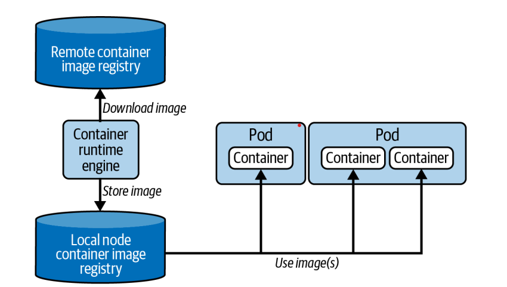

# Le Pod
## La création du Pod
La définition d’un Pod doit spécifier une image pour chaque conteneur. Lors de la création du Pod, le scheduler l’assigne à un nœud, puis le runtime vérifie si l’image est déjà présente ; sinon, il la télécharge depuis un registre. Une fois l’image disponible, le conteneur est créé et s’exécute.

<p align="center">
  
</p>

Créer un Pod de manière impérative avec les caractéristiques suivantes :
- Nom du Pod : hazelcast
- Image : hazelcast/hazelcast:5.1.7
- Port exposé : 5701
- Variable d’environnement : DNS_DOMAIN=cluster
- Labels :
- app=hazelcast
- env=prod
```bash
kubectl run hazelcast --image=hazelcast/hazelcast:5.1.7 --port=5701 --env="DNS_DOMAIN=cluster" --labels="app=hazelcast,env=prod"
```
Lors de l’exécution :
Kubernetes crée le Pod
le scheduler assigne le Pod à un node
le runtime télécharge l’image si nécessaire
puis le conteneur démarre automatiquement
```bash
kubectl get pods
kubectl describe pod hazelcast
kubectl exec hazelcast -- env (show environment vars)
kubectl logs hazelcast
kubectl logs -f hazelcast (show logs in real time)
kubectl exec -it hazelcast -- /bin/sh (executing a command in a container)
```

## Phases des Pods
- Pending → le Pod est accepté mais les images ne sont pas encore prêtes (download ou scheduling en cours)
- Running → au moins un conteneur est en cours d’exécution ou en démarrage
- Succeeded → tous les conteneurs se sont terminés avec succès
- Failed → au moins un conteneur s’est terminé avec une erreur
- Unknown → l’état du Pod n’a pas pu être déterminé (problème de communication avec le node)
## Restart Policy
Chaque Pod peut redémarrer ses conteneurs selon une règle appelée restartPolicy, gérée par kubelet.
- Always → redémarre automatiquement le conteneur après chaque arrêt peu importe la raison, même s’il s’est terminé avec succès.
- OnFailure → redémarre uniquement si le conteneur échoue
- Never → ne redémarre pas automatiquement le conteneur
---

Créer un Pod qui exécute une commande simple et se termine avec succès.  
- Nom : success-test
- Image : busybox
- Commande : echo "hello"
- Le Pod doit se terminer en Succeeded

```bash
kubectl run success-test --image=busybox --restart=Never -- echo "hello"
```
Créer un Pod qui échoue lors de l’exécution.  
- Nom : fail-test
- Image : busybox
- Commande : false
- Le Pod doit se terminer en Failed
```bash
kubectl run fail-test --image=busybox --restart=Never -- false
```
## le Pod temporaire
En général, les Pods exécutent des applications qui tournent en continu (comme un serveur web).
Mais parfois, on a juste besoin d’exécuter une commande rapide pour du debug ou diagnostic (ex: afficher les variables d’environnement, tester réseau…).
Dans ce cas, on utilise un Pod temporaire :
il exécute une commande
il se termine
il est supprimé automatiquement
Cela évite de garder un Pod inutile dans le cluster.  

Créer un Pod temporaire pour exécuter une commande de diagnostic, puis le supprimer automatiquement.
- Nom : busybox
- Image : busybox:1.36.1
- Exécuter la commande : env
- Le Pod doit être supprimé automatiquement après exécution
```bash
kubectl run busybox --image=busybox:1.36.1 --rm -it --restart=Never -- env
```
cela ce fait avec la combinaison de ces 3 options:  
*--rm* → supprime automatiquement le Pod après exécution
*-it* → mode interactif
*--restart=Never* → Pod simple (pas de restart)

#### Tester la communication entre deux Pods:
Créer deux Pods
Utiliser une image contenant ping (busybox ou alpine)
Vérifier la communication réseau entre eux

```bash
kubectl run pod1 --image=busybox --restart=Never -- sleep 3600  
kubectl run pod2 --image=busybox --restart=Never -- sleep 3600  

kubectl get pods -o wide (to get the addresses)

kubectl exec -it pod1 -- sh
ping @ip2
```

#### Communication entre Pods via IP

Créer un Pod nginx
Récupérer son adresse IP
Tester l’accès à ce Pod depuis un autre Pod temporaire (busybox)
```bash
kubectl run nginx --image=nginx:1.25.1 --port=80  

kubectl get pod nginx -o wide

kubectl run busybox --image=busybox:1.36.1 --rm -it --restart=Never -- wget @ip-nginx-pod:80
```

* chaque Pod reçoit une IP unique
* chaque node possède un sous-réseau (Pod CIDR)
* le CNI (ex: Flannel) permet la communication entre Pods sur différents nodes

#### Utiliser command et args dans un Pod
Dans un Pod, on peut :
* utiliser le **ENTRYPOINT** et **CMD** de l’image
* ou les **remplacer** avec :

  * `command` → remplace ENTRYPOINT
  * `args` → remplace CMD

Cela permet de définir exactement ce que le conteneur doit exécuter à l'initialisation.
Créer un Pod qui :
* utilise l’image `busybox:1.36.1`
* affiche la date toutes les 10 secondes en boucle
```bash
kubectl run mypod --image=busybox:1.36.1 --dry-run=client -o yaml -- /bin/sh -c "while true; do date; sleep 10; done" > pod.yaml
```
```yaml 
apiVersion: v1
kind: Pod
metadata:
  name: mypod
spec:
  containers:
  - name: mypod
    image: busybox:1.36.1
    args:
    - /bin/sh
    - -c
    - while true; do date; sleep 10; done
```
Alternative avec command + args

```yaml id="8y6r2j"
apiVersion: v1
kind: Pod
metadata:
  name: mypod
spec:
  containers:
  - name: mypod
    image: busybox:1.36.1
    command: ["/bin/sh"]
    args: ["-c", "while true; do date; sleep 10; done"]
```
```bash
kubectl apply -f pod.yaml
```
Étape 4 : Vérifier le fonctionnement

```bash 
kubectl logs mypod -f
```

---
# Le Namespace


Un **namespace** permet d’isoler les ressources Kubernetes (Pods, Services…) dans un cluster.
Par défaut, les objets sont créés dans le namespace `default`, mais on peut en créer d’autres pour organiser ou séparer les environnements (ex: dev, prod…).


Créer un namespace

```bash 
kubectl create namespace code-red
```

Vérifier :

```bash
kubectl get namespaces
```

Créer un Pod dans ce namespace

```bash
kubectl run pod --image=nginx:1.25.1 -n code-red
```

Lister les Pods :

```bash 
kubectl get pods -n code-red
```

---

Définir un namespace par défaut

```bash
kubectl config set-context --current --namespace=code-red
```

Vérifier :

```bash 
kubectl config view --minify | grep namespace:
```
Maintenant, toutes les commandes utilisent `code-red` sans `-n`.

Utiliser sans préciser le namespace

```bash 
kubectl get pods
```

Revenir au namespace default

```bash
kubectl config set-context --current --namespace=default
```
Supprimer le namespace

```bash 
kubectl delete namespace code-red
```
Tous les objets dans ce namespace seront supprimés automatiquement.

---
# LAB
```bash 
1. Create a new Pod named nginx running the image nginx:1.17.10 .
Expose the container port 80 . The Pod should live in the namespace named j43 .
Get the details of the Pod including its IP address.
Create a temporary Pod that uses the busybox:1.36.1 image to execute a wget command inside of the container. The wget command should access the endpoint exposed by the nginx container. You should see the HTML response body rendered in the terminal.
Get the logs of the nginx container.
Add the environment variables DB_URL=postgresql://mydb:5432 and DB_USERNAME=admin to the container of the nginx Pod.
Open a shell for the nginx container and inspect the contents of the current directory ls -l . Exit out of the container.
2. Create a YAML manifest for a Pod named loop in the namespace j43 that runs the busybox:1.36.1 image in a container. The container should run the following command: for i in {1..10}; do echo "Welcome $i times"; done . Create the Pod from the YAML manifest.
What’s the status of the Pod?
Edit the Pod named loop . Change the command to run in an endless loop. Each iteration should echo the current date.
Inspect the events and the status of the Pod loop .
```
