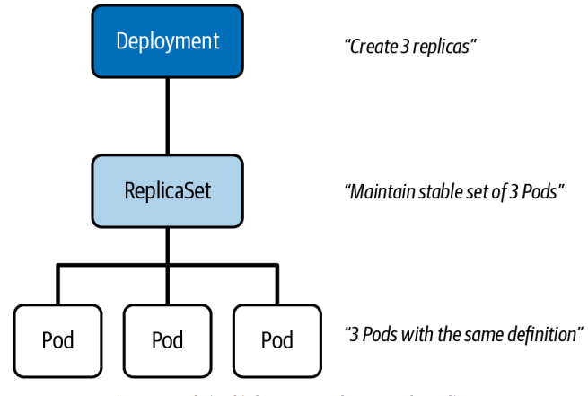
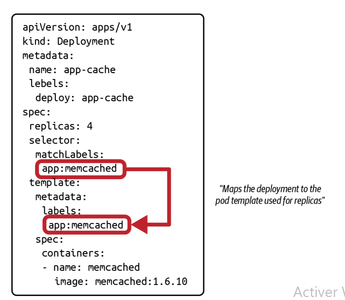
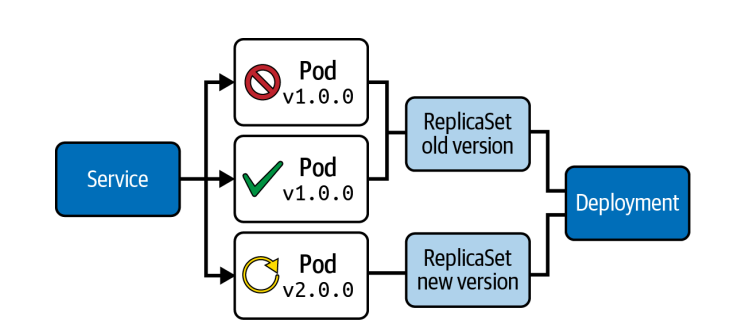

 # Deployment
<p align="center">
  
</p>

apiVersion: apps/v1
kind: Deployment
metadata:
 name: app-cache
 labels:
 app: app-cache
spec:
 replicas: 4
 selector:
 matchLabels:
 app: app-cache
 template:
 metadata:
 labels:
 app: app-cache
 spec:
 containers:
 - name: memcached
 image: memcached:1.6.8

### Labels et sélection des Pods

Lors de la création d’un Deployment, le label `app` est utilisé par défaut et apparaît dans :

* `metadata.labels` → label du Deployment (non utilisé pour sélectionner les Pods)
* `spec.selector.matchLabels` → utilisé pour sélectionner les Pods
* `spec.template.metadata.labels` → labels appliqués aux Pods
<p align="center">
  
</p>

**Important** :
Pour que la sélection fonctionne, les valeurs de
`spec.selector.matchLabels` et `spec.template.metadata.labels` doivent être identiques.
Sinon → erreur lors de la création.

Le champ `metadata.labels` peut être différent, il n’est pas utilisé pour le mapping Deployment → Pods.

---

#### Rolling Update (mise à jour progressive)

Un Deployment gère les mises à jour via des **ReplicaSets**.
<p align="center">
  
</p>

**Principe** :

* ancien ReplicaSet = ancienne version
* nouveau ReplicaSet = nouvelle version
* Kubernetes :

  * crée le nouveau ReplicaSet
  * démarre de nouveaux Pods
  * réduit progressivement les anciens Pods

Pendant la mise à jour :

* les deux versions coexistent
* le Service envoie le trafic vers les deux

---

#### Mise à jour de l’image

```bash
kubectl set image deployment app-cache memcached=memcached:1.6.10
```

Cette commande modifie uniquement l’image du conteneur dans le Pod template.

---

#### Vérifier le rollout

```bash
kubectl rollout status deployment app-cache
```
Affiche la progression :

* combien de Pods sont mis à jour
* quand le déploiement est terminé

---

#### Historique des versions (revisions)

```bash
kubectl rollout history deployment app-cache
```

**Chaque modification crée une revision**

* revision 1 → version initiale
* revision 2 → nouvelle image

Voir détail :

```bash 
kubectl rollout history deployment app-cache --revision=2
```

Permet de voir :

* image utilisée
* configuration du Pod

---

#### Rolling Update comportement

 **Important** :

* Kubernetes augmente progressivement les nouveaux Pods
* diminue progressivement les anciens Pods
* garantit disponibilité continue

---

## Changer la stratégie

```yaml
spec:
  strategy:
    type: Recreate
```

**RollingUpdate (default)** → zéro downtime
**Recreate** → supprime tout puis recrée → downtime
---
## PriorityClass avec Deployment

Un **PriorityClass** est une ressource Kubernetes qui permet de définir le **niveau d’importance d’un Pod** grâce à une valeur numérique.

Plus la valeur est élevée → plus le Pod est prioritaire.


Le scheduler Kubernetes utilise la priorité pour :

* décider quel Pod planifier en premier
* **supprimer** des Pods moins prioritaires si le cluster manque de ressources

La PriorityClass s’applique aux **Pods**, même s’ils sont créés via un **Deployment**.

#### Exemple de PriorityClass

```yaml 
apiVersion: scheduling.k8s.io/v1
kind: PriorityClass
metadata:
  name: high-priority
value: 100000
globalDefault: false
description: "Application critique"
```

#### Exemple avec Deployment

```yaml 
apiVersion: apps/v1
kind: Deployment
metadata:
  name: web-app
spec:
  replicas: 2
  selector:
    matchLabels:
      app: web-app
  template:
    metadata:
      labels:
        app: web-app
    spec:
      priorityClassName: high-priority
      containers:
      - name: nginx
        image: nginx
```

Tous les Pods créés par ce Deployment auront cette priorité.


#### En cas de manque de ressources

Si le cluster est plein :

* Kubernetes peut supprimer des Pods d’un autre Deployment (faible priorité)
* pour lancer les Pods du Deployment critique

Exemple de scénario

```text
Deployment A (priority=low) → Pods running
Deployment B (priority=high) → Pods pending

→ Kubernetes supprime Pods A
→ lance Pods B
```

## Rollback (retour arrière)

```bash 
kubectl rollout undo deployment app-cache
```

Ou version spécifique :

```bash 
kubectl rollout undo deployment app-cache --to-revision=1
```
* Kubernetes revient à l’ancienne version
* crée un nouveau ReplicaSet basé sur l’ancienne config

```bash 
kubectl rollout history deployment app-cache
```

* ne garde pas l’ancienne revision telle quelle
* recrée une nouvelle revision avec l’ancien contenu

# LAB
```bash
1. A team member wrote a Deployment manifest but has trouble with
creating the object from it. Help with finding the issue.
Navigate to the directory app-a/ch11/misconfigured-deployment of the
checked-out GitHub repository bmuschko/cka-study-guide.
Run a kubectl command to create the Deployment object defined in
the file fix-me-deployment.yaml. Inspect the error message. Fix the
Deployment manifest so that the object can be created.
2. Create a Deployment named nginx with three replicas. The Pods
should use the nginx:1.23.0 image and the name nginx . The
Deployment uses the label tier=backend . The Pod template should
use the label app=v1 .
List the Deployment and ensure that the correct number of replicas is
running.
Update the image to nginx:1.23.4 .
Verify that the change has been rolled out to all replicas.
Assign the change cause “Pick up patch version” to the revision.
Have a look at the Deployment rollout history. Revert the Deployment
to revision 1.
Ensure that the Pods use the image nginx:1.23.0 .
```
---
# QUESTION 3

Perform the following tasks:
Create a new PriorityClass named high-priority for user workloads with a value that is one less than the highest existing user-defined priority class value.
Patch the existing Deployment busybox-logger running in the priority namespace to use the high-priority priority class. Ensure that the busybox-logger Deployment rolls out successfully with the new priority class set.
Note - It is expected that pods from other Deployments running in the priority namespaces are evicted.

Apply these manifests before answering:
```bash
apiVersion: scheduling.k8s.io/v1
kind: PriorityClass
metadata:
  name: user-defined
value: 100000
globalDefault: false
description: "Existing user priority"
```
```bash
apiVersion: apps/v1
kind: Deployment
metadata:
  name: busybox-logger
  namespace: priority
spec:
  replicas: 2
  selector:
    matchLabels:
      app: busybox-logger
  template:
    metadata:
      labels:
        app: busybox-logger
    spec:
      containers:
      - name: busybox
        image: busybox
        command: ["/bin/sh"]
        args: ["-c", "while true; do echo hello; sleep 10; done"]
```
---
# CORRECTION

Ref: https://kubernetes.io/docs/concepts/scheduling-eviction/pod-priority-preemption/

Vérifier la valeur existante

```bash
kubectl get priorityclass
```
On a :

```text
user-defined   100000
```

Créer la nouvelle PriorityClass

valeur = 100000 - 1 = **99999** 

```yaml
apiVersion: scheduling.k8s.io/v1
kind: PriorityClass
metadata:
  name: high-priority
value: 99999
globalDefault: false
description: "High priority for user workloads"
```

```bash
kubectl apply -f pc.yaml
```

Modifier le Deployment

modifier le `priorityClassName`

```bash
kubectl patch deployment busybox-logger -n priority -p '{"spec":{"template":{"spec":{"priorityClassName":"high-priority"}}}}'
```
ou bien (Recommended method)

```bash
kibectl edit deployment busybox-logger
```
Vérifier le rollout

```bash
kubectl rollout status deployment busybox-logger -n priority
```

Vérifier les Pods

```bash
kubectl get pods -n priority -o wide
```
Vérification de la priorité

```bash
kubectl describe pod <-deployment-pod-name> -n priority
```
Voir :

```text
Priority: 99999
```

---
