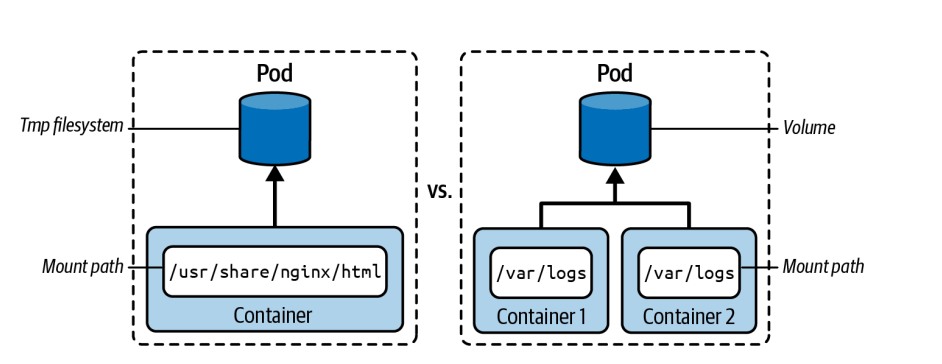

# Volumes
Dans Kubernetes, chaque conteneur possède un **filesystem temporaire** :

* isolé des autres conteneurs
* supprimé après redémarrage

Donc les données sont perdues.

Un **volume** est un répertoire partagé :

* entre plusieurs conteneurs d’un même Pod
* qui peut persister selon le type

<p align="center">
  
</p>

#### Objectifs des volumes

* **Persistance des données** → éviter la perte après restart
* **Partage de données** → communication entre conteneurs (sidecar)

---

#### Types de volumes (important examen)

* **emptyDir** → temporaire (durée de vie du Pod)
* **hostPath** → stockage du node

#### Principe d’utilisation

2 étapes :

1. Déclarer le volume

```yaml
spec.volumes
```

2. Le monter dans le conteneur

```yaml
spec.containers[].volumeMounts
```
Le lien se fait par le **name**

#### Exemple: volume partagé (emptyDir)

```yaml
apiVersion: v1
kind: Pod
metadata:
  name: business-app
spec:
  volumes:
  - name: shared-data
    emptyDir: {}

  containers:
  - name: nginx
    image: nginx:1.27.1
    volumeMounts:
    - name: shared-data
      mountPath: /usr/share/nginx/html

  - name: sidecar
    image: busybox:1.37.0
    volumeMounts:
    - name: shared-data
      mountPath: /data
```

```bash
kubectl apply -f pod-with-volume.yaml
```

```bash
kubectl get pod business-app
```

---

#### Test du volume

Entrer dans nginx :

```bash
kubectl exec -it business-app -c nginx -- /bin/sh
```

Créer un fichier :

```bash
cd /usr/share/nginx/html
touch example.html
ls
```

Résultat :

```text
example.html
```

Le volume `emptyDir` est :

* initialisé vide
* partagé entre conteneurs
* supprimé quand le Pod est supprimé

#### Exemple : Volume hostPath

Le volume **hostPath** permet de monter un fichier ou un dossier du **node (machine hôte)** dans un conteneur.

* dépend du node
* non portable
* utilisé surtout pour debug ou cas spécifiques

```yaml
apiVersion: v1
kind: Pod
metadata:
  name: hostpath-pod
spec:
  containers:
  - name: app
    image: busybox
    command: ["/bin/sh", "-c", "sleep 3600"]
    volumeMounts:
    - name: host-volume
      mountPath: /data
  volumes:
  - name: host-volume
    hostPath:
      path: /tmp
      type: Directory
```

* `/tmp` → dossier sur le node
* `/data` → monté dans le conteneur
* `type: Directory` → doit exister sur le node

#### Test

Entrer dans le Pod :
```bash
kubectl exec -it hostpath-pod -- sh
```
Créer un fichier :
```bash
cd /data
touch test.txt
```
Ce fichier existe aussi sur le node :
```bash
ls /tmp
```
# LAB

```bash
Create a Pod YAML manifest with two containers that use the image alpine:3.22.2 . Provide a command for both containers that keeps them running forever.
Define a volume of type emptyDir for the Pod. Container 1 should mount the volume to path /etc/a, and Container 2 should mount the volume to path /etc/b.
Open an interactive shell for Container 1 and create the directory data in the mount path. Navigate to the directory and create the file hello.txt with the contents “Hello World.” Exit out of the container.
Open an interactive shell for Container 2 and navigate to the directory /etc/b/data. Inspect the contents of file hello.txt. Exit out of the container.
```
---
# QUESTION 4

Update the existing deployment synergy-leverager, adding a co-located container named sidecar using the busybox:stable image to the existing pod.
The new co-located container has to run the following command: /bin/sh -c "tail -n+1 -f /var/log/synergy-leverager.log
(in our case we will use the nginx image since we don't have the synergy-leverager image and the command will be /bin/sh -c "tail -n+1 -f /var/log/nginx/access.log")
Use a volume mounted at /var/log (in our case /var/log/nginx) to make the log file synergy-leverager.log (in our case access.log) available to the co-located container.

before answering you should run this manifest
```bash
apiVersion: apps/v1
kind: Deployment
metadata:
  name: synergy-leverager
spec:
  replicas: 1
  selector:
    matchLabels:
      app: synergy
  template:
    metadata:
      labels:
        app: synergy
    spec:
      containers:
      - name: main
        image: nginx
```
car NGINX écrit dans :

/var/log/nginx/access.log
/var/log/nginx/error.log

---
# CORRECTION
```bash
kubectl edit deploy synergy-leverager
```
```bash
apiVersion: apps/v1
kind: Deployment
metadata:
  name: synergy-leverager
spec:
  replicas: 1
  selector:
    matchLabels:
      app: synergy
  template:
    metadata:
      labels:
        app: synergy
    spec:
      volumes:
      - name: log-volume
        emptyDir: {}
      containers:
      - name: main
        image: nginx
        volumeMounts:
        - name: log-volume
          mountPath: /var/log/nginx
      - name: sidecar
        image: busybox:stable
        command: ["/bin/sh", "-c", "tail -n+1 -f /var/log/nginx/access.log"]
        volumeMounts:
        - name: log-volume
          mountPath: /var/log/nginx
```
```bash
kubectl get pods
```
```bash
kubectl exec -it <pod-name> -c main -- ls /var/log/nginx
kubectl exec -it <pod-name> -c sidecar -- ls /var/log/nginx
```
