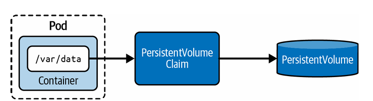

# Persistent Volumes 

Les **Persistent Volumes (PV)** permettent de **stocker des données de manière persistante**, même après la suppression d’un Pod.

Kubernetes utilise deux objets :

* **PersistentVolume (PV)** → stockage réel (fs, disque, cloud…)
* **PersistentVolumeClaim (PVC)** → demande de stockage par le Pod

Le Pod ne parle pas directement au PV, mais passe par le PVC.

<p align="center">
  
</p>

```text
Pod → PVC → PV → stockage réel
```

* le PV contient les données
* le PVC demande (taille, accès…)
* le Pod monte le PVC comme volume

Caractéristiques importantes:

* PV est **indépendant du Pod**
* données persistantes même si Pod supprimé
* peut être :

  * créé manuellement
  * ou dynamiquement (StorageClass)


#### Types de PersistentVolume

| Type     | Description                                                                          |
| -------- | ------------------------------------------------------------------------------------ |
| hostPath | Monte un fichier ou dossier du node. Utile en dev, pas recommandé en prod multi-node |
| local    | Stockage local performant, nécessite node spécifique                                 |
| nfs      | Partage entre plusieurs Pods (ReadWriteMany)                                         |
| csi      | Standard moderne pour connecter les solutions de stockage (cloud, prod)              |


#### Cas d’usage

* bases de données
* stockage de fichiers
* logs persistants

## Création de PersistentVolumes

Lorsque vous créez vous-même un objet **PersistentVolume**, on parle de **provisionnement statique**. Un PersistentVolume ne peut être créé qu’en utilisant une approche basée sur un manifeste. À ce jour, `kubectl` ne permet pas de créer un PersistentVolume avec la commande `create`.

Chaque PersistentVolume doit définir :

* la capacité de stockage via `spec.capacity`
* un mode d’accès via `spec.accessModes`


#### Exemple

L’exemple suivant crée un PersistentVolume nommé `db-pv` avec une capacité de 1 Gi et un accès lecture/écriture par un seul nœud. L’attribut `hostPath` monte le répertoire `/data/db` depuis le système de fichiers du nœud.

```yaml
apiVersion: v1
kind: PersistentVolume
metadata:
  name: db-pv
spec:
  capacity:
    storage: 1Gi
  accessModes:
  - ReadWriteOnce
  hostPath:
    path: /data/db
```

Lorsque vous inspectez le PersistentVolume créé, vous retrouvez les informations du manifeste. Le statut `Available` indique que l’objet est prêt à être utilisé.

La politique de récupération (**reclaim policy**) détermine ce qui se passe après libération du volume. Par défaut, l’objet est conservé (**Retain**).

```bash
kubectl apply -f db-pv.yaml
```

```bash
kubectl get pv db-pv
```

Résultat :

```text
NAME    CAPACITY   ACCESS MODES   RECLAIM POLICY   STATUS
db-pv   1Gi        RWO            Retain           Available
```
## Options de configuration d’un PersistentVolume

Un **PersistentVolume** offre plusieurs options de configuration qui déterminent son comportement à l’exécution. Pour l’examen, il est important de comprendre les notions de **mode d’accès**, **politique de récupération (reclaim policy)** et **affinité de nœud (node affinity)**.

### Mode d’accès

Chaque PersistentVolume définit comment il peut être utilisé via l’attribut `spec.accessModes`. Par exemple, un volume peut être monté en lecture/écriture par un seul Pod, ou en lecture seule par plusieurs nœuds.

| Type             | Abréviation | Description                          |
| ---------------- | ----------- | ------------------------------------ |
| ReadWriteOnce    | RWO         | Lecture/écriture par un seul nœud    |
| ReadOnlyMany     | ROX         | Lecture seule par plusieurs nœuds    |
| ReadWriteMany    | RWX         | Lecture/écriture par plusieurs nœuds |
| ReadWriteOncePod | RWOP        | Lecture/écriture par un seul Pod     |

### Politique de récupération (Reclaim Policy)

La politique de récupération définit ce qui se passe après suppression du **PersistentVolumeClaim**.

* Pour les volumes dynamiques → configuré dans la StorageClass
* Pour les volumes statiques → via `spec.persistentVolumeReclaimPolicy`


| Type    | Description                                                           |
| ------- | --------------------------------------------------------------------- |
| Retain  | (par défaut) Le volume est conservé et doit être nettoyé manuellement |
| Delete  | Supprime le volume et le stockage associé                             |
| Recycle | Obsolète (à ne plus utiliser)                                         |


### Node Affinity

L’affinité de nœud permet de restreindre les nœuds pouvant accéder à un PersistentVolume. C’est particulièrement important pour les volumes locaux (`local`, `hostPath`).

Elle est définie via `spec.nodeAffinity` avec des règles obligatoires.

---

## Exemple

```yaml
apiVersion: v1
kind: PersistentVolume
metadata:
  name: local-pv
spec:
  capacity:
    storage: 10Gi
  accessModes:
  - ReadWriteOnce
  persistentVolumeReclaimPolicy: Retain
  storageClassName: local-storage
  local:
    path: /mnt/data
  nodeAffinity:
    required:
      nodeSelectorTerms:
      - matchExpressions:
        - key: kubernetes.io/hostname
          operator: In
          values:
          - node01
          - node02
```

* Utilise un volume local → nécessite node affinity
* Restreint l’accès aux nœuds `node01` et `node02`

Lorsqu’un PVC est lié à un PV avec node affinity :

* les Pods seront planifiés uniquement sur les nœuds autorisés
* sinon (nœud unavailable) → Pod reste en **Pending**

--- 
# Persistent Volume Claim

#### Création des PersistentVolumeClaims

Le prochain objet à créer est le **PersistentVolumeClaim (PVC)**. Son rôle est de lier un **PersistentVolume (PV)** à un Pod.

#### Exemple

```yaml
kind: PersistentVolumeClaim
apiVersion: v1
metadata:
  name: db-pvc
spec:
  accessModes:
  - ReadWriteOnce
  storageClassName: ""
  resources:
    requests:
      storage: 256Mi
```

* Modes d’accès demandés
* `storageClassName: ""` → provisioning statique
* Taille minimale demandée

👉 Cela signifie :
“Donne-moi un PV de 256Mi avec accès ReadWriteOnce.”

---

#### Binding

Après création :

```bash
kubectl apply -f db-pvc.yaml
kubectl get pvc db-pvc
```

Résultat :

```text
db-pvc   Bound   db-pv   1Gi   RWO
```

`Bound` = PVC lié à un PV
relation **1:1 (exclusive)**


```bash
kubectl describe pvc db-pvc
```

```text
Used By: <none>
```

Aucun Pod ne l’utilise encore

#### Binding par nom (optionnel)

```yaml
apiVersion: v1
kind: PersistentVolumeClaim
metadata:
  name: specific-pvc
spec:
  volumeName: db-pv
  accessModes:
  - ReadWriteOnce
  resources:
    requests:
      storage: 1Gi
```

Lie directement au PV `db-pv`

Conditions :

* PV existe et disponible
* capacité suffisante
* accessModes compatibles
* storageClass identique

Sinon → PVC reste `Pending`

#### Monter un PVC dans un Pod

```yaml
apiVersion: v1
kind: Pod
metadata:
  name: app-consuming-pvc
spec:
  volumes:
  - name: app-storage
    persistentVolumeClaim:
      claimName: db-pvc
  containers:
  - image: alpine:3.22.2
    name: app
    command: ["/bin/sh"]
    args: ["-c", "while true; do sleep 60; done"]
    volumeMounts:
    - mountPath: /mnt/data
      name: app-storage
```

```bash
kubectl apply -f app-consuming-pvc.yaml
kubectl get pods
kubectl describe pod app-consuming-pvc
```

```text
Type: PersistentVolumeClaim
ClaimName: db-pvc
```

Le Pod utilise le PVC

```bash
kubectl describe pvc db-pvc
```

```text
Used By: app-consuming-pvc
```

```bash
kubectl exec app-consuming-pvc -it -- sh
cd /mnt/data
touch test.db
ls
```
---

# Storage Classes
Une **StorageClass** définit **comment créer un stockage automatiquement** (provisionnement dynamique) lorsqu’un PVC est créé.
permet de créer des PV automatiquement (provisionnement dynamique)

C’est quoi un provisioner ?

Le provisioner = composant qui sait créer le stockage réel

comme par exemple provisioner: kubernetes.io/gce-pd

Ça veut dire : "utilise GCP pour créer un disque"


#### Exemple

```yaml
apiVersion: storage.k8s.io/v1
kind: StorageClass
metadata:
  name: fast
provisioner: kubernetes.io/gce-pd
parameters:
  type: pd-ssd
  replication-type: regional-pd
```


```bash
kubectl get storageclass
```

#### Volume Binding Mode


Le **Volume Binding Mode** détermine **quand** le PersistentVolume est créé et lié au PVC.


1. Immediate (par défaut)

```text
PVC créé → PV créé immédiatement
```

Le volume est provisionné **tout de suite**, sans attendre le Pod.

ses Problème :

* peut créer un volume sur un mauvais node
* surtout avec stockage local (`local`, `hostPath`)

---

### 2. WaitForFirstConsumer

```text
PVC créé → rien
Pod créé → scheduler choisit node → PV créé
```

Le volume est créé **seulement quand un Pod l’utilise**

ses Avantages :

* évite les erreurs de node
* essentiel pour stockage local


#### Utilisation avec PVC

```yaml
kind: PersistentVolumeClaim
apiVersion: v1
metadata:
  name: db-pvc
spec:
  accessModes:
  - ReadWriteOnce
  resources:
    requests:
      storage: 512Mi
  storageClassName: standard
```

la création du pvc manuelle active provisioning dynamique


```bash
kubectl get pv,pvc
```

PV créé automatiquement
 

# LAB
```bash
1. Create a PersistentVolume named logs-pv that maps to the hostPath /var/logs. The access mode should be  ReadWriteOnce and ReadOnlyMany . Provision a storage capacity of 5 Gi. Ensure that the status of the PersistentVolume shows Available .
Create a PersistentVolumeClaim named logs-pvc . It uses ReadWriteOnce access. Request a capacity of 2 Gi. Ensure that the status of the PersistentVolume shows Bound .
Mount the PersistentVolumeClaim in a Pod running the image nginx at the mount path /var/log/nginx.
Open an interactive shell to the container and create a new file named my-nginx.log in /var/log/nginx. Exit out of the Pod.
Delete the Pod and re-create it with the same YAML manifest. Open an interactive shell to the Pod, navigate to the directory /var/log/nginx, and find the file you created before.
2. Navigate to the directory app-a/ch16/dynamic-provisioning of the checked-out GitHub repository 
bmuschko/cka-study-guide. Inspect the YAML manifest definition in the file local-path-storage-0.0.31.yaml.
Create the objects from the YAML manifest file.
Create a PersistentVolumeClaim named db-pvc in the namespace persistence . The access it uses is 
ReadWriteOnce . Request a capacity of 10 Mi. Use the storageclass name local-path .
Ensure that the status of the PersistentVolumeClaim object shows Pending . A PersistentVolume object should not have been provisioned yet.
Mount the PersistentVolumeClaim in a Pod named app-consuming pvc in the namespace 
persistence at the mount path /mnt/data. The container should use the image alpine:3.21.3 .
Wait until the Pod transitions into the Running status. Ensure that the PersistentVolume object has been created dynamically.
Open an interactive shell to the container, and create a new file named test.db in /mnt/data. Exit out of the Pod
```
# QUESTION 5
First, create a new StorageClass named local-path for an existing provisioner named rancher.io/local-path. Set the volume binding mode to WaitForFirstConsumer  
Note - Not setting the volume binding mode or setting it to anything other than WaitForFirstConsumer may result in reduced score. Next, Configure the StorageClass local-path as the default StorageClass.  
Note - Do not modify any existing Deployments or Persistent VolulmeClaims. Failure to do so may result in a reduced score.

# Correction
Ref: https://kubernetes.io/docs/concepts/storage/storage-classes/
Avant de définir un StorageClass par défaut, vérifier s’il en existe déjà un :
kubectl get storageclass
si un StorageClass est déjà marqué (default) :
Ne pas en avoir plusieurs par défaut
Retirer l’annotation de l’ancien :
```bash
kubectl patch storageclass <ancien-name> \
-p '{"metadata":{"annotations":{"storageclass.kubernetes.io/is-default-class":"false"}}}'
```
```bash
apiVersion: storage.k8s.io/v1
kind: StorageClass
metadata:
  name: local-path
  annotations:
    storageclass.kubernetes.io/is-default-class: "true"
provisioner: rancher.io/local-path
volumeBindingMode: WaitForFirstConsumer
```
```bash
kubectl apply -f sc.yaml
```

# QUESTION 6
A MariaDB Deployment in the mariadb namespace has been deleted by mistake. Your task is to restore the Deployment ensuring data persistence. Follow the steps:  
Create a Persistent Volume Claim (PVC) named mariadb in the mariadb namespace with the following specifications: Storage 250Mi  
Note - You must use the existing retained PersistentVolume (PV). There is only one existing PersistentVolume. 
Edit the MariaDB Deployment file located at ~/mariadb-deployment.yaml to use the PVC you created in the previous step. Apply the updated Deployment file to the cluster.  

you should apply these manifests before answering

```bash
kubectl create namespace mariadb
```
```bash
apiVersion: v1
kind: PersistentVolume
metadata:
  name: mariadb-pv
spec:
  capacity:
    storage: 250Mi
  accessModes:
    - ReadWriteOnce
  persistentVolumeReclaimPolicy: Retain
  hostPath:
    path: /mnt/data
```
```bash
kubectl apply -f pv.yaml
```
```bash

vim ~/mariadb-deployment.yaml
```
```bash
apiVersion: apps/v1
kind: Deployment
metadata:
  name: mariadb
  namespace: mariadb
spec:
  replicas: 1
  selector:
    matchLabels:
      app: mariadb
  template:
    metadata:
      labels:
        app: mariadb
    spec:
      containers:
      - name: mariadb
        image: mariadb:10.5
        env:
        - name: MYSQL_ROOT_PASSWORD
          value: rootpass
```
```bash

kubectl apply -f mariadb-deployment.yaml
```
```bash
kubectl delete deployment mariadb -n mariadb
```

# CORRECTION
```bash
apiVersion: v1
kind: PersistentVolumeClaim
metadata:
  name: mariadb
  namespace: mariadb
spec:
  accessModes:
    - ReadWriteOnce
  resources:
    requests:
      storage: 250Mi
  volumeName: mariadb-pv 
```
```bash
kubectl apply -f pvc.yaml
```
```bash
kubectl get pvc -n mariadb
```
Doit être Bound
Modifier le Deployment
```bash
apiVersion: apps/v1
kind: Deployment
metadata:
  name: mariadb
  namespace: mariadb
spec:
  replicas: 1
  selector:
    matchLabels:
      app: mariadb
  template:
    metadata:
      labels:
        app: mariadb
    spec:
      containers:
      - name: mariadb
        image: mariadb:10.5
        env:
        - name: MYSQL_ROOT_PASSWORD
          value: rootpass
        volumeMounts:
        - name: mariadb-storage
          mountPath: /var/lib/mysql
      volumes:
      - name: mariadb-storage
        persistentVolumeClaim:
          claimName: mariadb
```
```bash
kubectl apply -f mariadb-deployment.yaml
```
```bash
kubectl get pods -n mariadb
kubectl get pvc -n mariadb
kubectl get pv
```