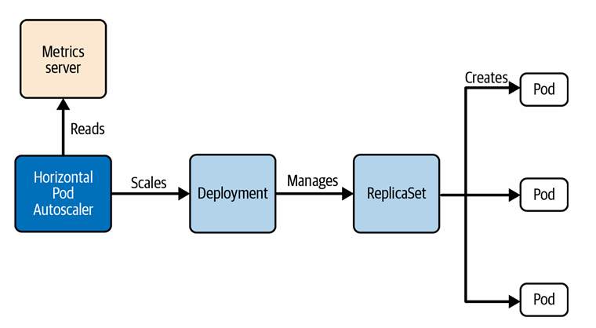
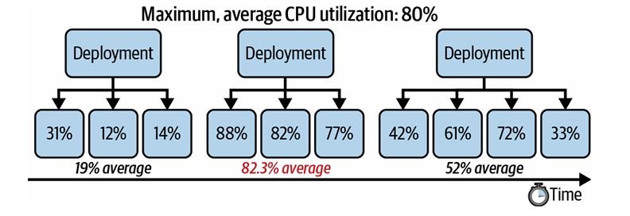

# Scaling du workloads

Il existe plusieurs raisons pour lesquelles il devient nécessaire de mettre à l’échelle une application, notamment pour maintenir des performances optimales face à une demande croissante. Par exemple, une application peut connaître une augmentation du nombre d’utilisateurs ou devoir traiter un volume de données plus important.

Dans Kubernetes, le scaling peut être réalisée de deux manières :

* en augmentant les ressources allouées à chaque Pod (**scaling vertical**)
* en ajustant le nombre de Pods (**scaling horizontal**)

Le scaling horizontal est particulièrement efficace pour gérer des charges variables et garantir la disponibilité de l’application.

---

## Scaling manuel

Le scaling manuel consiste à définir un nombre fixe de Pods à exécuter, basé sur des métriques ou des tests.

Cependant, la charge peut varier :

* augmentation soudaine
* baisse imprévisible

Nécessite une surveillance constante pour éviter :

* surprovisionnement (gaspillage)
* sous-provisionnement (dégradation des performances)

#### Exemple : scaler un Deployment


```bash
kubectl create deployment app-cache --replicas=3 --image=memcached:1.6.8
``` 

```bash
kubectl scale deployment app-cache --replicas=6
```

augmente les replicas de 3 à 6.  

Observer en temps réel

```bash
kubectl get pods -w
```

les Pods passent de :

* `ContainerCreating` → `Running`

---

## Autoscaling (HPA)

Une autre approche est d’utiliser un **HorizontalPodAutoscaler (HPA)**.  

permet de scaler automatiquement selon :

* CPU
* mémoire
Prérequis:  

* Metrics Server installé
* ressources CPU/mémoire définies dans les Pods
* ressources disponibles dans le cluster

<p align="center">
  
</p>

Création d’un HPA:  

```bash
kubectl autoscale deployment app-cache --cpu-percent=80 --min=3 --max=5
```
Cela signifie :  

* min = 3 Pods
* max = 5 Pods
* scale si CPU ≥ 80%

<p align="center">
  
</p>


YAML équivalent

```yaml
apiVersion: autoscaling/v2
kind: HorizontalPodAutoscaler
metadata:
  name: app-cache
spec:
  scaleTargetRef:
    apiVersion: apps/v1
    kind: Deployment
    name: app-cache
  minReplicas: 3
  maxReplicas: 5
  metrics:
  - resource:
      name: cpu
      target:
        type: Utilization
        averageUtilization: 80
```

```bash
kubectl get hpa
```
```text
TARGETS   <unknown>/80%
```

`<unknown>` signifie que Kubernetes **ne peut pas récupérer ou calculer les métriques CPU**

* soit le Metrics Server n’est pas installé
* soit les requests CPU? ne sont pas définies

### CPU Requests

Le **CPU request** est la quantité minimale de CPU que Kubernetes garantit à un conteneur. (baseline)

Il sert à :

* aider le scheduler à placer le Pod
* aide HPA à calculer l’utilisation de CPU

Exemple :

```yaml
resources:
  requests:
    cpu: 250m
```
### Formule utilisée par HPA

```text
utilisation = (CPU utilisé (consommation réelle) / CPU request) × 100
```
Kubernetes ne regarde pas uniquement le CPU utilisé, mais le compare à ce que le Pod a demandé.

Exemples :

```text
request = 200m
utilisé = 100m → 50%
utilisé = 200m → 100%
utilisé = 400m → 200%
```
Cela permet d’avoir une mesure standardisée.
#### Pourquoi ne pas utiliser seulement CPU utilisé ?
Parce que la valeur brute ne veut rien dire sans contexte :

```text
200m CPU → élevé ou faible ?
```

* Pod A (request = 100m) → (200/100)*100 = 200% → surcharge (>80%)
* Pod B (request = 1000m) → (200/1000)*100 = 20% → normal (<80%)

même valeur, signification différente

#### Pourquoi HPA a besoin de ça?

HPA fonctionne avec un **pourcentage**, pas une valeur brute :
```text
objectif = 80%
```

* > 80% → scale up
* <80% → scale down

#### CPU Limits

Le **CPU limit** est la quantité maximale de CPU que le conteneur est autorisé à utiliser.

Il sert à :

* empêcher un conteneur de consommer trop de CPU
* protéger les autres Pods sur le même node

Exemple :

```yaml
resources:
  requests:
    cpu: 250m
  limits:
    cpu: 500m
```
ici :

* minimum garanti = 250m
* maximum autorisé = 500m

Différence Requests vs Limits

```text 
requests → réservation (garantie)
limits   → plafond (maximum)
```
Si un Pod atteint son CPU limit, il est ralenti (throttling) mais continue de fonctionner, contrairement à la mémoire limit où il est tué (OOMKilled).

#### Définir le Resource requirements

```yaml
kubectl edit deploy app-cached
```
```yaml
resources:
  requests:
    cpu: 250m
    memory: 128Mi
  limits:
    cpu: 500m
    memory: 256Mi
```

```bash
kubectl get hpa
```
```text
TARGETS   15%/80%
```
#### Affichage des détails du HorizontalPodAutoscaler (HPA)

Le journal d’événements d’un HPA peut fournir des informations supplémentaires sur les activités de mise à l’échelle. L’affichage des détails du HPA permet de voir quand le nombre de replicas a été augmenté ou diminué, ainsi que les conditions de scaling.

```bash
kubectl describe hpa app-cache
```
---

#### Définir plusieurs métriques

Il est possible d’utiliser plusieurs métriques (CPU + mémoire) pour le scaling.


#### Exemple HPA avec CPU + mémoire

```yaml
apiVersion: autoscaling/v2
kind: HorizontalPodAutoscaler
metadata:
  name: app-cache
spec:
  scaleTargetRef:
    apiVersion: apps/v1
    kind: Deployment
    name: app-cache
  minReplicas: 3
  maxReplicas: 5
  metrics:
  - type: Resource
    resource:
      name: cpu
      target:
        type: Utilization
        averageUtilization: 80
  - type: Resource
    resource:
      name: memory
      target:
        type: AverageValue
        averageValue: 500Mi
```

#### Définir les ressources (obligatoire)

```yaml
kubectl edit deploy app-cached
```
```yaml
resources:
  requests:
    cpu: 250m
    memory: 100Mi
  limits:
    cpu: 500m
    memory: 500Mi
```
nécessaire pour que HPA fonctionne correctement


```bash
kubectl get hpa
```

Exemple :

```text
TARGETS   1994752/500Mi, 0%/80%
```
signifie :

* mémoire actuelle / cible
* CPU actuel / cible

--- 
# QUESTION 7


Create a Horizontal Pod Scaler (HPA) named apache-server in the auto-scale namespace. This HPA must target existing deployment called apache-server in the auto-scale namespace.
Set the HPA to aim for 50% CPU usage per pod. Configure it to have at least 1 pod and at max 4 pod.
Also set the downscale stabilization window to 30 seconds.

# CORRECTION
Ref: https://kubernetes.io/docs/concepts/workloads/autoscaling/horizontal-pod-autoscale/
```bash
apiVersion: autoscaling/v2
kind: HorizontalPodAutoscaler
metadata:
  name: apache-server
  namespace: auto-scale
spec:
  scaleTargetRef:
    apiVersion: apps/v1
    kind: Deployment
    name: apache-server
  minReplicas: 1
  maxReplicas: 4
  metrics:
  - type: Resource
    resource:
      name: cpu
      target:
        type: Utilization
        averageUtilization: 50
  behavior:
    scaleDown:
      stabilizationWindowSeconds: 30
```

```bash
kubectl get hpa -n auto-scale
```
OU
```bash

kubectl autoscale deployment apache-server --cpu-percent=50 --min=1 --max=4 -n auto-scale --dry-run=client -o yaml > hpa.yml
```
```bash
behavior:
  scaleDown:
    stabilizationWindowSeconds: 30
```
```bash
kubectl apply -f hpa.yml
```
# QUESTION 8
You are managing a Wordpress applicacion running in a kubernetes clusters
Your task is to adjust the Pod resource requests and limits to ensure stable operation. Follow the instructions below:
1. Scale down the wordpress Deployment to 0 replicas.
2. Edit the Deployment and divide node resources evenly across all 3 Pods.
3. Assign fair and equal CPU and menory requests to each Pod.
4. Add sufficient overhead to avoid node instability.
Ensure that both the init containers and main containers use exactly the same resource requests and limits.
After making the changes, scale the Deployment back to 3 replicas.

# CORRECTION 
Scale Down Deployment
```bash
kubectl scale deployment wordpress --replicas=0
```
inspect node's resources
```bash
kubectl describe node node01
```
```text
Capacity:
  cpu:                1
  ephemeral-storage:  19221248Ki
  hugepages-2Mi:      0
  memory:             1948924Ki

Non-terminated Pods:          (2 in total)
  Namespace                   Name                  CPU Requests  CPU Limits  Memory Requests  Memory Limits  Age
  ---------                   ----                  ------------  ----------  ---------------  -------------  ---
  kube-system                 cilium-envoy-nt5j6    0 (0%)        0 (0%)      0 (0%)           0 (0%)         23d
  kube-system                 cilium-h49bb          100m (10%)    1 (100%)    10Mi (0%)        1Gi (56%)      23d

Allocated resources:
  (Total limits may be over 100 percent, i.e., overcommitted.)
  Resource           Requests    Limits
  --------           --------    ------
  cpu                100m (10%)  1 (100%)
  memory             10Mi (0%)   1Gi (56%)
  ephemeral-storage  0 (0%)      0 (0%)
  hugepages-2Mi      0 (0%)      0 (0%)
```
Convert Capacity

```text
CPU: 1 core = 1000m
Memory: 1948924Ki ÷ 1024 ≈ 1903Mi
```
Subtract kube-system usage

```text
CPU: 1000m - 100m = 900m
Memory: 1903Mi - 10Mi ≈ 1893Mi
```
Apply 10% Overhead

```text
CPU: 900 - (900 × 0.1) = 810m
Memory: 1893 - (1893 × 0.1) ≈ 1703Mi
```
Divide Across 3 Pods

```text
CPU: 810 / 3 = 270m
Memory: 1703 / 3 ≈ 567Mi
```

Final Values (Rounded)

```yaml
resources:
  requests:
    cpu: "270m"
    memory: "560Mi"
  limits:
    cpu: "300m"
    memory: "600Mi"
```
IMPORTANT — Init Containers MUST MATCH

* Kubernetes uses the **MAX(initContainers, containers)**
* Values MUST be identical

```yaml
initContainers:
- name: init-container
  image: busybox
  resources:
    requests:
      cpu: "270m"
      memory: "560Mi"
    limits:
      cpu: "300m"
      memory: "600Mi"

containers:
- name: wordpress
  image: wordpress
  resources:
    requests:
      cpu: "270m"
      memory: "560Mi"
    limits:
      cpu: "300m"
      memory: "600Mi"
```
Scale Up Deployment

```bash
kubectl scale deployment wordpress --replicas=3
```
Verification

```bash
kubectl describe pod <pod-name>
```


* requests = 270m / 560Mi
* limits = 300m / 600Mi
* initContainers = containers
Final Formula

```text
(Capacity - kube-system) - 10% → ÷ number of Pods
```
