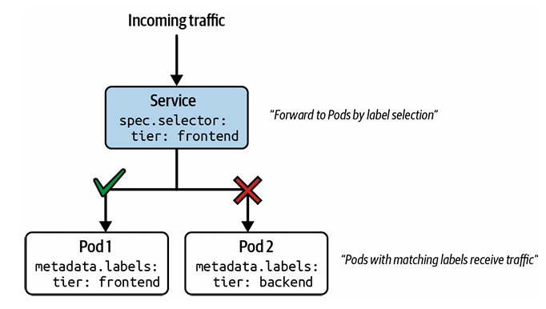
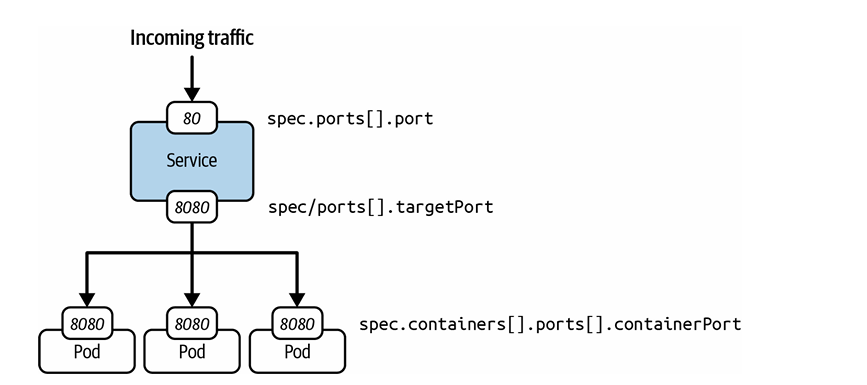
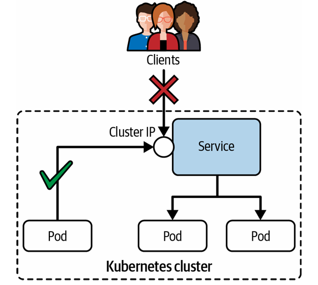
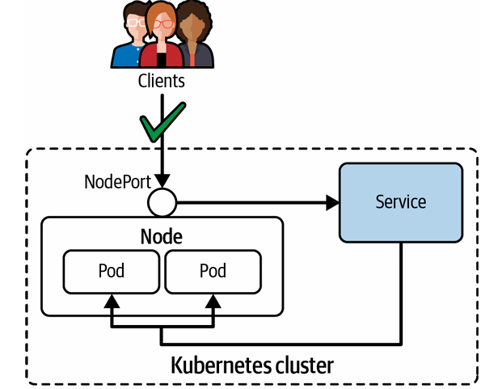
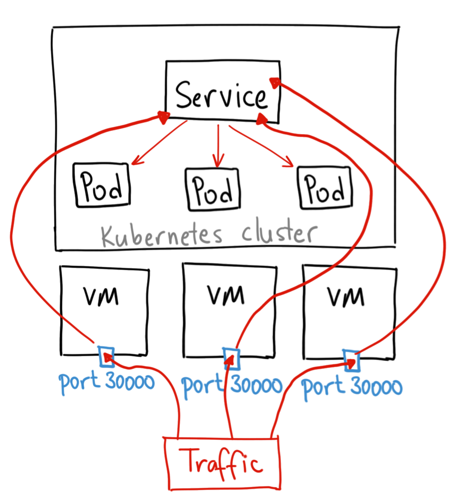
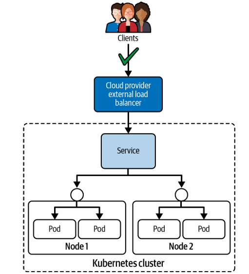

# Services
Nous avons vu qu’il est possible de communiquer avec un Pod via son adresse IP. Cependant, *lors du redémarrage d’un Pod, une nouvelle adresse IP virtuelle lui est automatiquement attribuée*. Par conséquent, les autres composants du système ne peuvent pas se baser sur l’adresse IP d’un Pod pour communiquer de manière fiable.

Dans une architecture microservices, où chaque composant s’exécute dans son propre Pod et doit communiquer avec les autres via une interface réseau stable, il est nécessaire d’utiliser une autre ressource : le **Service**.

Le Service fournit une couche d’abstraction au-dessus des Pods en attribuant une adresse IP virtuelle fixe (ClusterIP) qui représente tous les Pods ayant des labels correspondants. Ce chapitre se concentre sur le fonctionnement des Services, et en particulier sur la manière d’exposer les Pods à l’intérieur et à l’extérieur du cluster en fonction de leur type.

<p align="center">
  
</p>


En résumé, les **Services** fournissent des noms découvrables et du load balancing pour un ensemble de Pods. Le Service reste indépendant des adresses IP grâce au composant DNS du plan de contrôle Kubernetes, un aspect abordé dans “Découverte du Service via DNS”. Comme un Deployment, le Service sélectionne les Pods via des labels.

La figure 17-1 illustre ce fonctionnement : le Pod 1 reçoit le trafic car son label correspond à la sélection du Service, tandis que le Pod 2 ne reçoit rien car son label ne correspond pas.


## Types de Services

Chaque Service possède un type, qui détermine comment il est exposé à l’intérieur et/ou à l’extérieur du cluster.

| Type         | Description                                                                                                                                                    |
| ------------ | -------------------------------------------------------------------------------------------------------------------------------------------------------------- |
| ClusterIP    | Expose le Service via une IP interne au cluster. Accessible uniquement depuis le cluster. Kubernetes utilise un algorithme round-robin pour répartir le trafic |
| NodePort     | Expose le Service sur chaque nœud via un port statique. Accessible depuis l’extérieur du cluster. Pas de load balancing entre les nœuds                        |
| LoadBalancer | Expose le Service via un load balancer externe fourni par le cloud                                                                                             |

## Quand utiliser chaque type ?

* **ClusterIP** → communication interne entre Pods
* **NodePort** → exposition simple externe (dev/test, peu utilisé en production)
* **LoadBalancer** → exposition externe avec load balancing (production, mais coûteux)


## Port Mapping

Un Service utilise les labels pour cibler les Pods, mais le routage dépend du mapping des ports.

* `spec.ports[].port` → port exposé par le Service
* `spec.ports[].targetPort` → port du conteneur
* Le `targetPort` doit correspondre à : `containerPort`
Sinon → le Pod ne reçoit pas le trafic

<p align="center">
  
</p>---

## Création des Services

Vous pouvez créer des Services de différentes manières, certaines étant plus adaptées à l’examen car elles sont plus rapides. Commençons par l’approche impérative.

Un Service doit sélectionner un Pod avec un label correspondant. Le Pod créé avec la commande suivante s’appelle `echoserver` et expose l’application sur le port 8080. Kubernetes lui attribue automatiquement le label `run=echoserver` :

```bash id="n3k9vd"
kubectl run echoserver --image=k8s.gcr.io/echoserver:1.10 --restart=Never --port=8080
```

Vous pouvez créer un Service avec la commande `create service`. Il faut préciser le type de Service. Ici, on utilise `ClusterIP`. L’option `--tcp` définit le mapping des ports :

```bash 
kubectl create service clusterip echoserver --tcp=80:8080
```
Port 80 → exposé par le Service
Port 8080 → port du conteneur

Une méthode encore plus rapide consiste à utiliser `kubectl run` avec l’option `--expose`, qui crée le Pod et le Service en une seule commande :

```bash 
kubectl run echoserver --image=k8s.gcr.io/echoserver:1.10 --restart=Never --port=8080 --expose
```

le port et le target port sera 8080 , le service par défaut sera cluster ip
En pratique, on utilise souvent un **Deployment + Service** :

```bash 
kubectl create deployment echoserver --image=hashicorp/http-echo:1.0.0 --replicas=5
```
```bash 
kubectl rdit deployment echoserver
```
```bash 
ports:
    - containerPort: 8080
```

```bash
kubectl expose deployment echoserver --port=80 --target-port=8080
```

Pour vérifier:
```bash
kubectl get endpoints echoserver
```
```bash
kubectl run test-pod --image=busybox:1.35 --rm -it -- /bin/sh
```
```bash
wget -qO- http://<service-name>:<port>
```
#### Lister les Services

Lister tous les Services affiche une vue en tableau incluant :

* le type du Service
* l’adresse ClusterIP
* une éventuelle adresse externe
* les ports exposés

Exemple avec le Service `echoserver` :

```bash 
kubectl get services
```

```text id="f1q9mz"
NAME         TYPE        CLUSTER-IP      EXTERNAL-IP   PORT(S)   AGE
echoserver   ClusterIP   10.109.241.68   <none>        80/TCP    6s
```
Kubernetes assigne une ClusterIP car le type est **ClusterIP**
Pas d’IP externe pour ce type
Service accessible sur le port 80

#### Afficher les détails d’un Service

Pour diagnostiquer un problème, on peut utiliser :

```bash 
kubectl describe service echoserver
```

Champs importants :

* `Selector`
* `IP`
* `Port`
* `TargetPort`
* `Endpoints`

Problèmes fréquents :

* labels incorrects
* ports mal configurés

```text id="c9p4xr"
Selector:          app=echoserver
IP:                10.109.241.68
Port:              80/TCP
TargetPort:        8080/TCP
Endpoints:         172.17.0.4:8080,172.17.0.5:8080...
```


#### Endpoints
`Endpoints` = liste des Pods ciblés
Un endpoint est :
une IP + port d’un Pod
Si aucun endpoint :

* problème de labels
* ou Pods non disponibles
---
# Service ClusterIP
<p align="center">
  
</p>

Nous allons créer un Pod et un Service pour démontrer le comportement du type **ClusterIP**.

Le Pod `echoserver` expose le port 8080 et possède le label `app=echoserver`.
Le Service expose le port 5005 et redirige vers le port 8080 du Pod.

```bash 
kubectl run echoserver --image=k8s.gcr.io/echoserver:1.10 --restart=Never --port=8080 -l app=echoserver
```

```bash 
kubectl create service clusterip echoserver --tcp=5005:8080
```


```bash
kubectl get service echoserver -o yaml
```

Exemple :

```yaml 
spec:
  type: ClusterIP
  clusterIP: 10.96.254.0
  selector:
    app: echoserver
  ports:
  - port: 5005
    targetPort: 8080
```

`clusterIP` = IP virtuelle du Service


```bash 
kubectl get service echoserver
NAME         TYPE        CLUSTER-IP    PORT(S)
echoserver   ClusterIP   10.96.254.0   5005/TCP
```

#### Accéder au Service

Depuis l’extérieur du cluster :

```bash
wget 10.96.254.0:5005
```
Échec (ClusterIP interne uniquement)

Depuis un Pod :

```bash
kubectl run tmp --image=busybox:1.36.1 --restart=Never -it --rm -- wget 10.96.254.0:5005
```
Succès

#### Découverte via DNS

Kubernetes utilise **CoreDNS** pour mapper :

```text id="v8g2zp"
nom du service → ClusterIP
```

```bash
kubectl run tmp --image=busybox:1.36.1 --restart=Never -it --rm -- wget echoserver:5005
```

#### Cross-namespace

```bash
kubectl run tmp --image=busybox:1.36.1 --restart=Never -it --rm -n other -- wget echoserver.default:5005
```
Format :

```text 
service.namespace
```
Full DNS :

```text 
echoserver.default.svc.cluster.local
```
---
# Service NodePort

Déclarer un Service de type **NodePort** permet de l’exposer via l’adresse IP d’un nœud et de le rendre accessible depuis l’extérieur du cluster Kubernetes. L’accès se fait avec l’IP du nœud et un port compris entre **30000 et 32767** (appelé node port), attribué automatiquement lors de la création du Service.

<p align="center">
  
</p>

Le node port est ouvert sur tous les nœuds du cluster, et sa valeur est unique au niveau du cluster. Pour éviter les conflits, il est recommandé de ne pas spécifier manuellement le port et de laisser Kubernetes en choisir un.
<p align="center">
  
</p>
#### Création et inspection du Service

Les commandes suivantes créent un Pod et un Service de type NodePort :

```bash
kubectl run echoserver --image=k8s.gcr.io/echoserver:1.10 --restart=Never --port=8080 -l app=echoserver
```

```bash
kubectl create service nodeport echoserver --tcp=5005:8080
```

---

## Représentation du Service

```yaml
spec:
  type: NodePort
  clusterIP: 10.96.254.0
  selector:
    app: echoserver
  ports:
  - port: 5005
    nodePort: 30158
    targetPort: 8080
```

* `NodePort` → type de Service
* `nodePort` → port externe attribué automatiquement

Vérification

```bash id="c7m3dz"
kubectl get service echoserver
```

```text id="z8x2kd"
NAME         TYPE       CLUSTER-IP       PORT(S)
echoserver   NodePort   10.101.184.152   5005:30158/TCP
```

`30158` = node port (accessible depuis l’extérieur)
`5005` = port interne

#### Accès au Service

Depuis le cluster

```bash
kubectl run tmp --image=busybox:1.36.1 --restart=Never -it --rm -- wget 10.101.184.152:5005
```

fonctionne comme un ClusterIP

Depuis l’extérieur

Récupérer l’IP d’un node :

```bash id="p3k8xy"
kubectl get nodes -o jsonpath='{ $.items[*].status.addresses[?(@.type=="InternalIP")].address }'
```

Puis accéder :

```bash
wget 192.168.64.15:30158
```
accès externe via :

```text 
NodeIP:NodePort
```
---
# Service LoadBalancer


Le dernier type de Service est **LoadBalancer**. Ce type provisionne un load balancer externe (principalement via les fournisseurs cloud) qui expose une IP unique pour distribuer le trafic vers les nœuds du cluster. La stratégie de load balancing (ex : round-robin) dépend du provider.
<p align="center">
  
</p>

Pour les clusters on-premise :
Kubernetes ne fournit pas de load balancer natif. Des solutions comme **MetalLB** permettent de combler ce manque.

Le load balancer distribue le trafic entre les nœuds, tant que les Pods correspondent aux labels sélectionnés.

Création et inspection du Service

```bash id="q8p1wd"
kubectl run echoserver --image=k8s.gcr.io/echoserver:1.10 --restart=Never --port=8080 -l app=echoserver
```

```bash
kubectl create service loadbalancer echoserver --tcp=5005:8080
```
Représentation du Service

```yaml
spec:
  type: LoadBalancer
  clusterIP: 10.96.254.0
  loadBalancerIP: 10.109.76.157
  selector:
    app: echoserver
  ports:
  - port: 5005
    targetPort: 8080
    nodePort: 30158
```

* `LoadBalancer` → type de Service
* `loadBalancerIP` → IP externe

---

## Vérification

```bash
kubectl get service echoserver
```

```text id="x4t9ln"
NAME         TYPE           CLUSTER-IP      EXTERNAL-IP     PORT(S)
echoserver   LoadBalancer   10.109.76.157   10.109.76.157   5005:30642/TCP
```

L’IP externe peut prendre du temps à apparaître

Accès au Service

```bash 
wget 10.109.76.157:5005
```
accès depuis l’extérieur du cluster

* fonctionne aussi comme :

  * ClusterIP
  * NodePort
* ajoute une couche externe

# LAB
```bash
1. You need to expose a web application that runs on port 80 and has a metrics endpoint on port 9090. The application should be accessible from outside the cluster.
Create a Deployment named webapp using the image nginxdemos/hello:0.4-plain-text with three replicas.
Create a Service named webapp-service of type poses port 80 as port 80 (name it NodePort that exweb ), and exposes port 9090 as port
9090 (name it metrics ). Set the node port for the web port to 30080.
Use appropriate selectors to target your Deployment.
Verify the Service is working by accessing it through the ClusterIP.
2. You have a backend database and a frontend application. The frontend needs to connect to the database using service discovery. Both should only be accessible within the cluster.
Create a Deployment named database with one replica using image mysql:9.4.0 with these environment variables:
MYSQL_ROOT_PASSWORD=secretpass and 
Create a MYSQL_DATABASE=myapp .
ClusterIP Service named database-service that exposes port 3306 and targets the database Pods.
Create a Deployment named frontend with two replicas using image busybox:1.35 that runs a command to continuously test the database
connection using the following command: 
sh -c "while true; do nc-zv database-service 3306; sleep 5; done"
Verify that the frontend Pods can resolve and connect to the database Service
```

