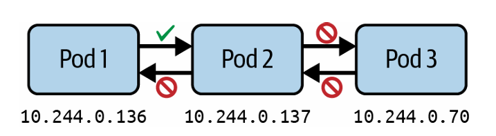
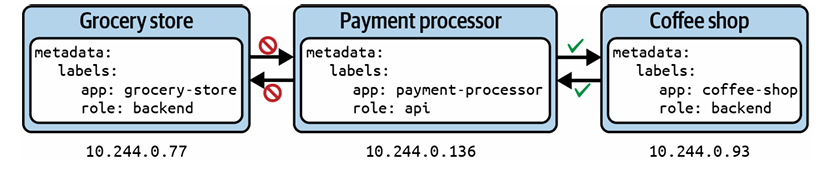

# Network Policies

Le plugin **Container Network Interface (CNI)** gère l’attribution des adresses IP depuis un sous-réseau lorsqu’un nouveau Pod est créé sur un nœud. Par conséquent, les Pods peuvent communiquer facilement avec tous les autres Pods du cluster, peu importe le nœud.  

Par défaut, Kubernetes autorise une communication **sans restriction entre tous les Pods**, même entre différents namespaces. Cela représente un risque de sécurité important, car un Pod compromis pourrait accéder à des services sensibles dans un autre namespace.  


Par exemple, il n’est pas logique qu’une application backend communique directement avec le frontend. La communication devrait aller du frontend vers le backend.
---

Les **Network Policies** fonctionnent comme des règles de pare-feu, conçues pour contrôler la communication entre Pods. Ces règles définissent :

* la direction du trafic (**ingress** et/ou **egress**)
* les Pods concernés
* les namespaces concernés
* les ports ciblés
<p align="center">
  
</p>
Ce contrôle fin permet de sécuriser le cluster et de maîtriser les flux réseau.


#### Network Policy Controller

Une NetworkPolicy ne fonctionne pas sans un **network policy controller**.
Ce contrôleur :
* analyse les règles
* applique les restrictions réseau

Vous pouvez trouver plusieurs implémentations dans la documentation Kubernetes.

Certains CNI comme **Flannel** :

* ne supportent pas les Network Policies
* les règles sont acceptées mais non appliquées

Exemple avec Cilium

**Cilium** est un CNI qui implémente un network policy controller.

Après installation, vous verrez des Pods dans `kube-system` :

```bash
kubectl get pods -n kube-system
```

```text
cilium-xxxxx
cilium-operator-xxxxx
```
#### Création d’une Network Policy

La sélection par labels joue un rôle essentiel pour déterminer quels Pods sont concernés par une Network Policy. Ce concept est déjà utilisé dans d’autres objets Kubernetes (comme Deployment et Service).

Une Network Policy définit aussi la **direction du trafic** :

* **ingress** → trafic entrant
* **egress** → trafic sortant

Pour chaque direction, on peut autoriser (allowlist) :

* des Pods
* des IP
* des ports

Important

* Les Network Policies **ne s’appliquent pas aux Services**
* Elles s’appliquent uniquement aux **Pods et namespaces**


#### Scénario
Imaginons que vous avez un Pod qui expose une API, par exemple un service de paiement utilisé par plusieurs applications. Votre entreprise est en train de migrer vers un nouveau système de paiement, mais toutes les applications ne sont pas encore compatibles.

Actuellement, deux applications utilisent ce service :

un magasin (grocery-store)
un café (coffee-shop)

Chaque application tourne dans son propre Pod.

Cependant :  

* le café est prêt à utiliser la nouvelle API 
* le magasin ne l’est pas encore 
Objectif :  
* autoriser uniquement le Pod coffee-shop à accéder au Pod payment-processor, et bloquer le reste.

<p align="center">
  
</p>

---

#### Création des Pods

```bash id="x7m2qs"
kubectl run grocery-store --image=nginx:1.25.3-alpine -l app=grocery-store,role=backend --port 80
```

```bash id="y4k8dz"
kubectl run payment-processor --image=nginx:1.25.3-alpine -l app=payment-processor,role=api --port 80
```

```bash id="p9w1tr"
kubectl run coffee-shop --image=nginx:1.25.3-alpine -l app=coffee-shop,role=backend --port 80
```
Test avant policy

Par défaut → tout fonctionne :

```bash 
kubectl get pod payment-processor --template '{{.status.podIP}}'
```

```bash 
kubectl exec grocery-store -it -- wget --spider --timeout=1 <IP>
```

```bash 
kubectl exec coffee-shop -it -- wget --spider --timeout=1 <IP>
```

Les deux Pods peuvent accéder au service


#### Création de la Network Policy

uniquement en YAML (pas de `kubectl create`)

```yaml 
apiVersion: networking.k8s.io/v1
kind: NetworkPolicy
metadata:
  name: api-allow
spec:
  podSelector:
    matchLabels:
      app: payment-processor
      role: api
  policyTypes:
    - Egress
    - Ingress
  ingress:
  - from:
    - podSelector:
        matchLabels:
          app: coffee-shop
  egress:
  - to:
    - podSelector:
        matchLabels:
          app: coffee-shop
```

Applique la policy au Pod `payment-processor`
Autorise uniquement `coffee-shop`

Test après policy

```bash 
kubectl apply -f networkpolicy-api-allow.yaml
```

Résultat

```bash 
kubectl exec grocery-store -it -- wget --spider --timeout=1 <IP>
```

refusé

```bash 
kubectl exec coffee-shop -it -- wget --spider --timeout=1 <IP>
```
autorisé  
#### Attributs spec d’une NetworkPolicy

| Attribute   | Description                                                                                  |
| ----------- | -------------------------------------------------------------------------------------------- |
| podSelector | Sélectionne les Pods dans le namespace auxquels la network policy s’applique                 |
| policyTypes | Définit le type de trafic (ingress et/ou egress) auquel la policy s’applique                 |
| ingress     | Liste les règles de trafic entrant. Chaque règle peut définir des sections `from` et `ports` |
| egress      | Liste les règles de trafic sortant. Chaque règle peut définir des sections `to` et `ports`   |

---

#### Attributs des sélecteurs `to` et `from`

| Attribute                       | Description                                                                                                       |
| ------------------------------- | ----------------------------------------------------------------------------------------------------------------- |
| podSelector                     | Sélectionne des Pods par label(s) dans le même namespace autorisés comme source (ingress) ou destination (egress) |
| namespaceSelector               | Sélectionne des namespaces par label(s) dont tous les Pods sont autorisés comme source ou destination             |
| namespaceSelector + podSelector | Sélectionne des Pods par label(s) dans des namespaces eux-mêmes sélectionnés par label(s)                         |

#### Lister les Network Policies

Lister les Network Policies fonctionne comme pour n’importe quelle ressource Kubernetes. On utilise la commande `get` avec le type `networkpolicy` ou son raccourci `netpol`. 

```bash 
kubectl get networkpolicy api-allow
```

```text 
NAME         POD-SELECTOR                     AGE
api-allow    app=payment-processor,role=api   83m
```

Cette sortie affiche seulement :

* le nom
* le Pod selector

Elle ne montre pas les règles ingress/egress en détail. 

#### Afficher les détails d’une Network Policy

Pour voir plus d’informations, on utilise :

```bash 
kubectl describe networkpolicy api-allow
```

Cela affiche :

* Pod selector
* règles ingress
* règles egress

Exemple :

```text id="p9q1rm"
PodSelector: app=payment-processor,role=api

Allowing ingress traffic:
  To Port: <any>
  From:
    PodSelector: app=coffee-shop

Not affecting egress traffic
Policy Types: Ingress
```

Cela permet de comprendre quelles communications sont autorisées. 

La sortie ne montre pas directement quels Pods sont affectés
Il faut tester avec des Pods qui matchent ou non la policy


#### Default Network Policy (deny all)

Principe : **least privilege (moindre privilège)**
tout bloquer puis ouvrir uniquement ce qui est nécessaire 

Exemple

```yaml 
apiVersion: networking.k8s.io/v1
kind: NetworkPolicy
metadata:
  name: default-deny-all
  namespace: internal-tools
spec:
  podSelector: {}
  policyTypes:
  - Ingress
  - Egress
```

`{}` = tous les Pods du namespace

Effet

aucune communication possible entre Pods

```bash
kubectl exec metrics-consumer -it -n internal-tools -- wget --spider --timeout=1 <IP>
```

timeout


#### Restriction par port

Par défaut :
tous les ports sont ouverts
Bonne pratique :

* autoriser uniquement les ports nécessaires

Exemple

```yaml
apiVersion: networking.k8s.io/v1
kind: NetworkPolicy
metadata:
  name: port-allow
  namespace: internal-tools
spec:
  podSelector:
    matchLabels:
      app: api
  ingress:
  - from:
    - podSelector:
        matchLabels:
          app: consumer
    ports:
    - protocol: TCP
      port: 80
```
autorise uniquement le port 80
# LAB
```bash
1. Your cluster has two teams working in separate namespaces. You need to implement network policies that control cross-namespace communication.
Navigate to the directory app-a/ch20/cross-namespace-control of the checked-out GitHub repository bmuschko/cka-study-guide. 
Create the objects from the YAML manifest setup.yaml. Inspect the objects in the namespaces team-alpha and team-beta .
Create a NetworkPolicy in the team-alpha namespace that allows the alpha-app Pod to connect only to the team-beta namespace and denies all other egress traffic except DNS.
Create a NetworkPolicy in the team-beta namespace that allows the beta-app Pod to receive traffic from team-alpha namespace on port 80 and denies all other ingress traffic.
Test the policies to ensure that the alpha-app Pod can reach the app Pod, the 
alpha-app Pod cannot reach external sites, and the beta-app Pod cannot receive traffic from other sources.
2. You have a three-tier application with frontend, backend, and database components. You need to implement network policies to ensure only the backend Pod can access the database, while the can only communicate with the frontend backend Pod.
Navigate to the directory app-a/ch20/database-access-control of the checked-out GitHub repository bmuschko/cka-study-guide. Create the objects from the YAML manifest setup.yaml. Inspect the objects in the namespace production .
Create a NetworkPolicy named database-policy that applies to Pods with label 
tier=database . It should only allow ingress from Pods with label tier= back end on port 6379.
Create a NetworkPolicy named backend-policy that applies to Pods with label 
tier=backend . It should only allow ingress from Pods with label tier=frontend on port 80. Allow egress to Pods with label tier=database on port 6379. Allow DNS resolution on port 53.
Create a default deny-all ingress policy for the namespace. production Verify your policies by testing connectivity: the frontend Pod should not be able to reach the database. The frontend Pod should be able to reach the backend Pod. The backend Pod should be able to reach the database Pod.
```
# QUESTION 10
Install and set up a Container Network Interface (CNI) that meets these requirements: Pick and install one of the CNI options:
The CNI you choose must satisfy following requirement: *native network policy support*
Flannel version 0.26.1  
Manifest - https://github.com/flanner-io/flanner/releases/download/v0.26.1/kube-flanner.yml
Calico version 3.28.2  
Manifest - https://raw.githubusercontent.com/projectcalico/calico/v3.28.2/manifests/tigera-operator.yaml
# CORRECTION
```bash
kubectl apply -f https://raw.githubusercontent.com/projectcalico/calico/v3.28.2/manifests/tigera-operator.yaml
```
```bash
kubectl get pods -n calico-system
```

# QUESTION 11
There are two deployments. frontend and backend deployment.
frontend will be in frontend NS and backend will be in backend NS.
Apply the least permissive policy to have interaction between frontend and backend deployment.
Below are the 3 YAML file to apply network policy.
Choose either of them with least permission.
1 YAML - pod selector of all. type is ingress and pod selector with all
2 YAML - pod selector as well as namsespace selector are present
3 YAML - pod selector, NS selector, POD CIDR
```bash
POLICY 1
apiVersion: networking.k8s.io/v1
kind: NetworkPolicy
metadata:
  name: open-backend-access
  namespace: backend
spec:
  podSelector: {}
  policy Types:
  - Ingress
      ingress:
      - from: []
      ports:
        protocol: TCP
        port: 8080
```
```bash
apiVersion: networking.k8s.io/v1
kind: NetworkPolicy
metadata:
  name: frontend-to-backend
  namespace: backend
spec:
  podSelector:
    matchLabels:
      app: backend
  policyTypes:
  - Ingress
  ingress:
  - from:
    - namespaceSelector:
        matchLabels:
          kubernetes.io/metadata.name: frontend
      podSelector:
        matchLabels:
          app: frontend
    ports:
    - protocol: TCP
      port: 8080
```
```bash
apiVersion: networking.k8s.io/v1
kind: NetworkPolicy
metadata:
  name: frontend-to-backend-with-cidr
  namespace: backend
spec:
  podSelector:
    matchLabels:
      app: backend
  policyTypes:
  - Ingress
  ingress:
  - from:
    - namespaceSelector:
        matchLabels:
          kubernetes.io/metadata.name: frontend
      podSelector:
        matchLabels:
          app: frontend
    ports:
    - protocol: TCP
      port: 8080
  - from:
    - ipBlock:
        cidr: 192.168.1.0/24
    ports:
    - protocol: TCP
      port: 8080
```
# CORRECTION

#### Policy 1
```yaml
podSelector: {}
ingress:
- from: []
```
Autorise tout le trafic entrant vers tous les pods
Trop permissive
Incorrecte
#### Policy 3
Autorise :
les pods frontend
mais aussi un bloc IP externe (CIDR)
Introduit un accès non nécessaire
Trop permissive
Incorrecte
#### Policy 2 (Correcte)
Restreint précisément :
namespace frontend
pods avec label app=frontend
Respecte le principe du moindre privilège
Correcte
```bash
kubectl apply -f <policy2>
```