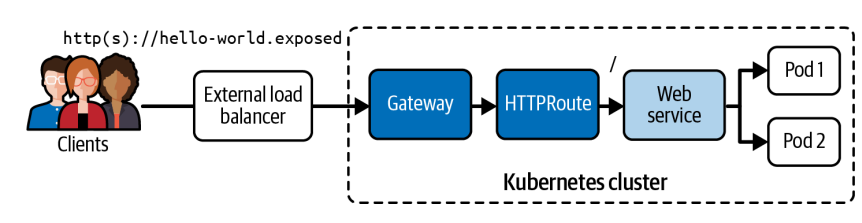
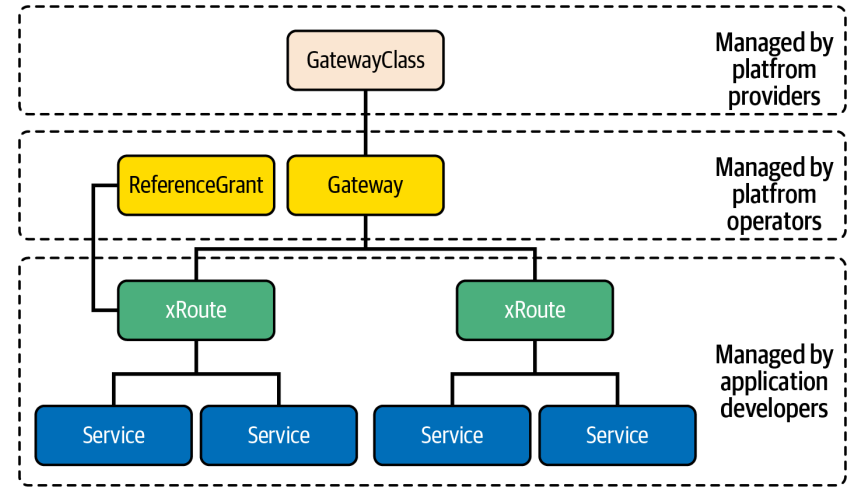

# Gateway API

La Gateway API a été introduite pour standardiser et améliorer les enseignements tirés d’Ingress et des frameworks de service mesh comme Istio, Contour et Linkerd, qui ont montré le besoin de capacités de gestion du trafic plus avancées que ce qu’Ingress pouvait offrir.

En tant qu’alternative plus expressive et extensible à la ressource Ingress traditionnelle, la Gateway API propose :
- un design orienté rôles  
- le support de plusieurs protocoles (pas seulement HTTP/HTTPS)  
- des fonctionnalités avancées de routage  

La Gateway API est le successeur d’Ingress et devient de plus en plus importante pour gérer le trafic externe.

<p align="center">
  
</p>

#### Migration Ingress → Gateway API

Remplacer :
- Ingress → Gateway + HTTPRoute  

Avantages :
- séparation claire des responsabilités  
- plus flexible  
- plus puissant  

#### Ressources Gateway API

La Gateway API introduit plusieurs objets :
<p align="center">
  
</p>

#### 1. Gateway
définit l’infrastructure (ex: load balancer)

#### 2. GatewayClass
définit le type de controller utilisé  

#### 3. HTTPRoute / GRPCRoute
règles de routage vers les services  

#### 4. ReferenceGrant
permet le routage entre namespaces  


#### Installer MetalLB
```bash
kubectl apply -f https://raw.githubusercontent.com/metallb/metallb/v0.13.12/config/manifests/metallb-native.yaml
```
Configurer un pool d’IP :
```bash
apiVersion: metallb.io/v1beta1
kind: IPAddressPool
metadata:
  name: pool
  namespace: metallb-system
spec:
  addresses:
  - 192.168.49.240-192.168.49.250
---
apiVersion: metallb.io/v1beta1
kind: L2Advertisement
metadata:
  name: adv
  namespace: metallb-system
```
```bash
kubectl apply -f metallb-config.yaml
```
MetalLB fournit une IP externe comme un cloud provider
#### Installer Gateway API CRDS et le controller

Par défaut, la Gateway API n’est pas installée.
```bash
helm install eg oci://docker.io/envoyproxy/gateway-helm \
--version v1.4.2 \
-n envoy-gateway-system \
--create-namespace
```
Cette commande :
- installe CRDs + controller  
- crée le deployment envoy-gateway  

Vérifier le controller
```bash
kubectl wait --timeout=5m -n envoy-gateway-system deployment/envoy-gateway \
--for=condition=Available
```
Attend que le controller soit prêt  

#### Créer une GatewayClass
```bash
apiVersion: gateway.networking.k8s.io/v1
kind: GatewayClass
metadata:
  name: envoy
spec:
  controllerName: gateway.envoyproxy.io/gatewayclass-controller
```
```bash
kubectl apply -f gateway-class.yaml
```
Définit quel controller sera utilisé  
```bash
kubectl get gatewayclasses
```

#### Créer un Gateway
```bash
apiVersion: gateway.networking.k8s.io/v1
kind: Gateway
metadata:
  name: hello-world-gateway
spec:
  gatewayClassName: envoy
  listeners:
  - name: http
    protocol: HTTP
    port: 80
```
```bash
kubectl apply -f gateway.yaml
```
Ouvre un point d’entrée HTTP  

```bash
kubectl get gateways
```

#### Créer un HTTPRoute
```bash
apiVersion: gateway.networking.k8s.io/v1
kind: HTTPRoute
metadata:
  name: hello-world-httproute
spec:
  parentRefs:
  - name: hello-world-gateway
  hostnames:
  - "hello-world.exposed"
  rules:
  - matches:
    - path:
        type: PathPrefix
        value: /
    backendRefs:
    - name: web
      port: 80
```
```bash
kubectl apply -f httproute.yaml
```
Définit le routage vers un Service  

```bash
kubectl get httproutes
```

#### Ajouter DNS local
```bash
echo "192.168.49.240 hello-world.exposed" >> /etc/hosts
```

#### Tester
```bash
curl hello-world.exposed:80
```
Résultat :
Hello World


# QUESTION 13
You have an existing web application deployed in a Kubernetes cluster using an Ingress resource named web.
You must migrate the existing Ingress configuration to the new Kubernetes Gateway API, maintaining the existing HTTPS access configuration
1. Create a Gateway Resource named web-gateway with hostname gateway.web.k8s.local that maintains the exisiting TLS and listener configuration from the existing Ingress resource named web.
2. Create a HTTPRoute resource named web-route with hostname gateway.web.k8s.local that maintains the existing routing rules from the current Ingress resource named web.  
Note: A GatewayClass named nginx-class is already installed in the cluster

script for question setup
```bash
#!/bin/bash
set -e

echo "🚀 Setting up Kubernetes Gateway API migration lab..."

# 1. Install Gateway API CRDs (official source)
echo "📦 Installing Gateway API CRDs..."
kubectl apply -k "github.com/kubernetes-sigs/gateway-api/config/crd?ref=v1.1.0" >/dev/null

# 2. Deploy a simple nginx web app
cat <<EOF | kubectl apply -f -
apiVersion: apps/v1
kind: Deployment
metadata:
  name: web-deployment
spec:
  replicas: 2
  selector:
    matchLabels:
      app: web
  template:
    metadata:
      labels:
        app: web
    spec:
      containers:
      - name: web
        image: nginx
        ports:
        - containerPort: 80
EOF

# 3. Create a service for the web app
cat <<EOF | kubectl apply -f -
apiVersion: v1
kind: Service
metadata:
  name: web-service
spec:
  selector:
    app: web
  ports:
  - name: http
    port: 80
    targetPort: 80
EOF

# 4. Create a self-signed TLS certificate and secret
echo "🔐 Creating TLS certificate..."
openssl req -x509 -nodes -days 365 -newkey rsa:2048 \
  -keyout tls.key -out tls.crt \
  -subj "/CN=gateway.web.k8s.local/O=web" >/dev/null 2>&1

kubectl create secret tls web-tls --cert=tls.crt --key=tls.key >/dev/null
rm -f tls.crt tls.key

# 5. Create an existing Ingress resource (to migrate from)
cat <<EOF | kubectl apply -f -
apiVersion: networking.k8s.io/v1
kind: Ingress
metadata:
  name: web
  annotations:
    nginx.ingress.kubernetes.io/rewrite-target: /
spec:
  ingressClassName: nginx
  tls:
  - hosts:
    - gateway.web.k8s.local
    secretName: web-tls
  rules:
  - host: gateway.web.k8s.local
    http:
      paths:
      - path: /
        pathType: Prefix
        backend:
          service:
            name: web-service
            port:
              number: 80
EOF

# 6. Create a working GatewayClass (using a mock nginx controller)
cat <<EOF | kubectl apply -f -
apiVersion: gateway.networking.k8s.io/v1
kind: GatewayClass
metadata:
  name: nginx-class
spec:
  controllerName: gateway.envoyproxy.io/gatewayclass-controller
EOF

echo
echo "✅ Gateway API lab setup complete!"
echo
echo "Resources created:"
echo "  - Deployment: web-deployment"
echo "  - Service: web-service"
echo "  - Ingress: web"
echo "  - GatewayClass: nginx-class"
echo
echo "🎯 Next steps:"
echo "  1️⃣  Create a Gateway named web-gateway using hostname gateway.web.k8s.local and nginx-class."
echo "  2️⃣  Create a HTTPRoute named web-route referencing web-service."
echo "  3️⃣  Use 'kubectl get gatewayclass,gateway,httproute -A' to verify."
```
# SOLUTION
```bash
# Step 1: Inspect existing assets (host, secret, backend service/port)
kubectl describe ingress web
kubectl describe secret web-tls
```
```bash
# Step 2: Create Gateway (mirrors Ingress host + TLS)
cat <<'EOF' > gw.yaml
apiVersion: gateway.networking.k8s.io/v1
kind: Gateway
metadata:
  name: web-gateway
spec:
  gatewayClassName: nginx-class
  listeners:
  - name: https
    protocol: HTTPS
    port: 443
    hostname: gateway.web.k8s.local
    tls:
      mode: Terminate
      certificateRefs:
      - kind: Secret
        name: web-tls
EOF
```
```bash
kubectl apply -f gw.yaml
```
```bash
kubectl get gateway
```
```bash
# Step 3: Create HTTPRoute (mirrors Ingress rules)
cat <<'EOF' > http.yaml
apiVersion: gateway.networking.k8s.io/v1
kind: HTTPRoute
metadata:
  name: web-route
spec:
  parentRefs:
  - name: web-gateway
  hostnames:
  - "gateway.web.k8s.local"
  rules:
  - matches:
    - path:
        type: PathPrefix
        value: /
    backendRefs:
    - name: web-service
      port: 80
EOF
```
```bash
kubectl apply -f http.yaml
```bash
```bash
# Step 4: Verify
kubectl describe gateway web-gateway
kubectl describe httproute web-route
```

