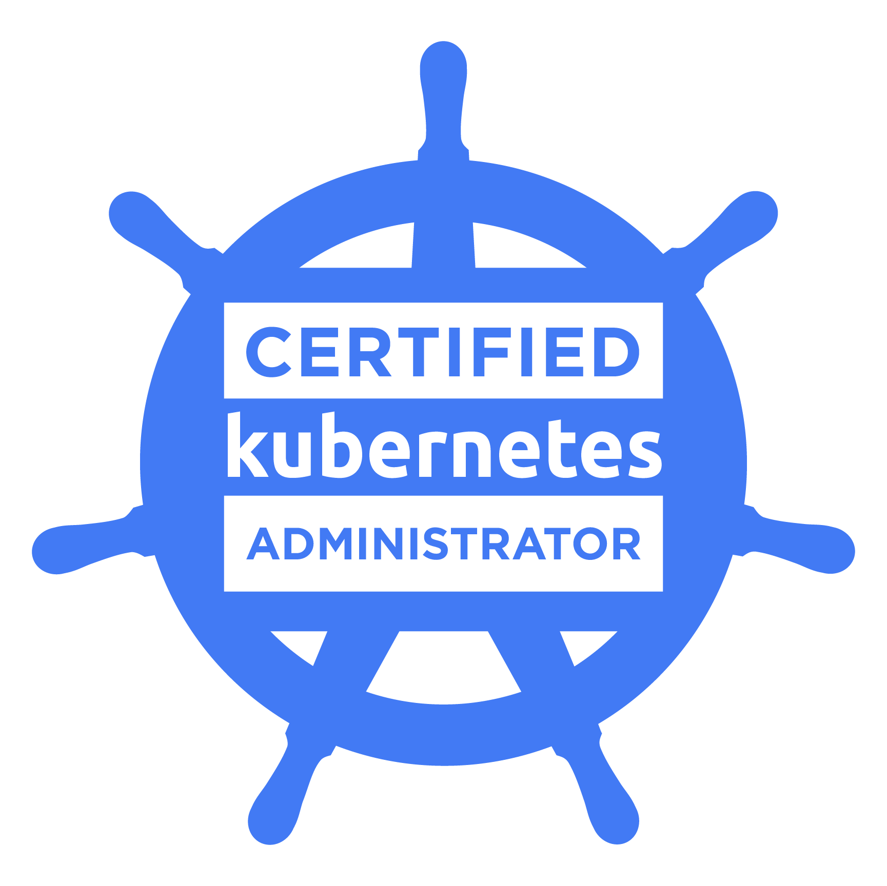

# CKA Training

  

### Introduction
👋 Welcome to this course on Kubernetes administration.  
This course is designed to prepare you for the CKA (Certified Kubernetes Administrator) exam!

### 📌 Notes

Explanations are written in **French**.  
Labs and exercises are written in **English**.  

### 🔧 Why this course?

Practical Skills: Learn how to understand, install, configure, and manage Kubernetes clusters.  
Recognized Certification: Prepare for the CKA certification, which is globally recognized and highly sought after by employers.  
Career Opportunities: Increase your chances of landing jobs as a Kubernetes administrator, DevOps engineer, and more.  

### 📚 What you will learn:

Cluster Architecture: Understand Kubernetes architecture and core components.  
Installation & Configuration: Install Kubernetes clusters using kubeadm.  
Workloads & Scheduling: Manage Pods, Deployments, DaemonSets, and Jobs.  
Services & Networking: Configure Services, DNS, and network policies.  
Storage: Work with persistent volumes and storage classes.  
Troubleshooting: Diagnose and resolve cluster and application issues.  
Cluster Maintenance: Upgrade clusters and manage nodes.  
Security: Manage RBAC, service accounts, and cluster security.  

### 🎯 Course Objectives:

Provide you with the knowledge and skills necessary to pass the CKA exam.  
Prepare you to effectively manage Kubernetes clusters in a professional environment.  
Build your Kubernetes administration expertise through practical exercises and labs.  

### 🎓 Who is this course for?

Beginners in Kubernetes: Those looking to start learning Kubernetes.  
IT Professionals: Those who want to certify their skills and advance in their careers.  
Students: Those studying computer science and looking to gain practical experience.  

Join us on this journey and become a certified Kubernetes administrator! 🚀

### 📚 Table of Contents

- [Comprendre Kubernetes](01-comprendre-kubernetes.md)  
- [Installer Kubernetes](02-installer-kubernetes.md)  
- [Interagir avec Kubernetes](03-interagir-avec-kubernetes.md)